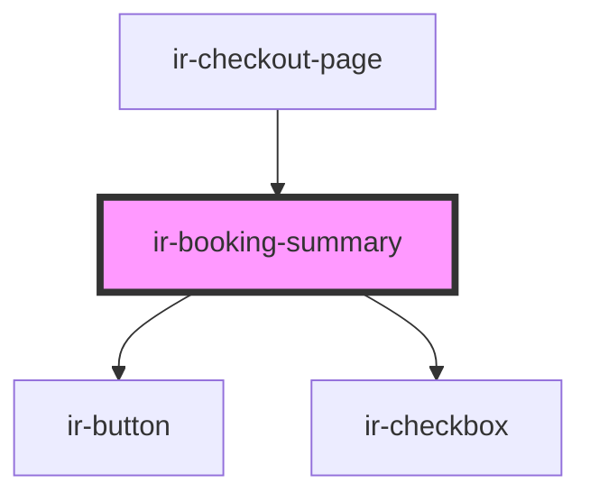

# ir-booking-summary

<!-- Auto Generated Below -->

## Properties

| Property    | Attribute    | Description | Type      | Default |
| ----------- | ------------ | ----------- | --------- | ------- |
| `isLoading` | `is-loading` |             | `boolean` | `false` |

## Events

| Event            | Description | Type                                   |
| ---------------- | ----------- | -------------------------------------- |
| `bookingClicked` |             | `CustomEvent<null>`                    |
| `routing`        |             | `CustomEvent<"booking" \| "checkout">` |

## Dependencies

### Used by

 - [ir-checkout-page](..)

### Depends on

- [ir-button](../../../ui/ir-button)
- [ir-checkbox](../../../ui/ir-checkbox)

### Graph

----------------------------------------------

*Built with [StencilJS](https://stenciljs.com/)*
