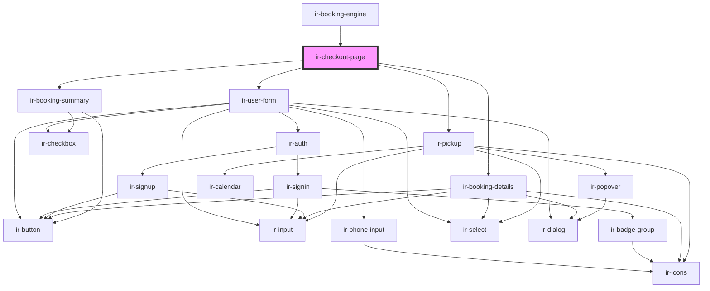

# ir-checkout-page

<!-- Auto Generated Below -->

## Dependencies

### Used by

 - [ir-booking-engine](..)

### Depends on

- [ir-user-form](ir-user-form)
- [ir-booking-details](ir-booking-details)
- [ir-pickup](ir-pickup)
- [ir-booking-summary](ir-booking-summary)

### Graph

----------------------------------------------

*Built with [StencilJS](https://stenciljs.com/)*
