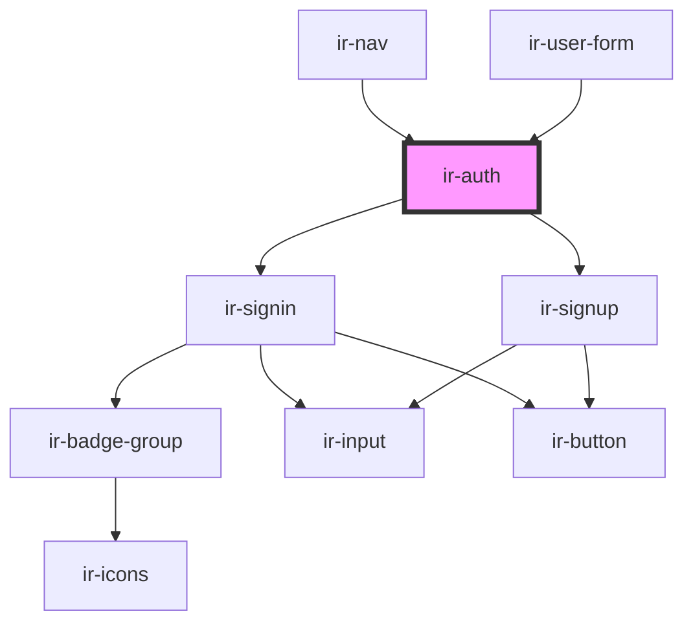

# ir-auth

<!-- Auto Generated Below -->

## Events

| Event         | Description | Type                |
| ------------- | ----------- | ------------------- |
| `closeDialog` |             | `CustomEvent<null>` |

## Dependencies

### Used by

 - [ir-nav](..)
 - [ir-user-form](../../ir-checkout-page/ir-user-form)

### Depends on

- [ir-signin](ir-signin)
- [ir-signup](ir-signup)

### Graph

----------------------------------------------

*Built with [StencilJS](https://stenciljs.com/)*
