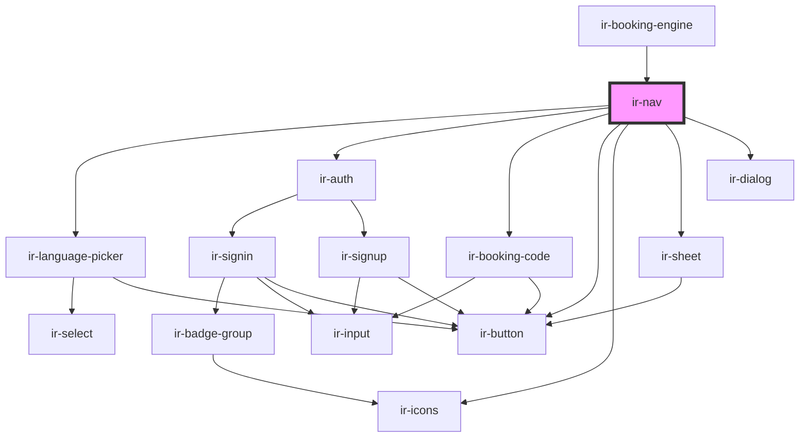

# ir-nav

<!-- Auto Generated Below -->

## Properties

| Property     | Attribute | Description | Type                  | Default     |
| ------------ | --------- | ----------- | --------------------- | ----------- |
| `currencies` | --        |             | `ICurrency[]`         | `undefined` |
| `languages`  | --        |             | `IExposedLanguages[]` | `undefined` |
| `logo`       | `logo`    |             | `string`              | `undefined` |
| `website`    | `website` |             | `string`              | `undefined` |

## Dependencies

### Used by

 - [ir-booking-engine](..)

### Depends on

- [ir-language-picker](ir-language-picker)
- [ir-auth](ir-auth)
- [ir-booking-code](../ir-booking-page/ir-booking-code)
- [ir-button](../../ui/ir-button)
- [ir-icons](../../ui/ir-icons)
- [ir-sheet](../../ui/ir-sheet)
- [ir-dialog](../../ui/ir-dialog)

### Graph

----------------------------------------------

*Built with [StencilJS](https://stenciljs.com/)*
