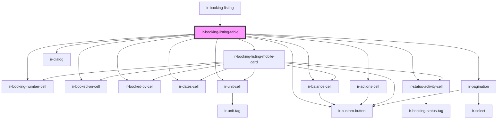

# ir-booking-listing-table

<!-- Auto Generated Below -->

## Events

| Event                   | Description | Type                                 |
| ----------------------- | ----------- | ------------------------------------ |
| `openBookingDetails`    |             | `CustomEvent<string>`                |
| `requestPageChange`     |             | `CustomEvent<PaginationChangeEvent>` |
| `requestPageSizeChange` |             | `CustomEvent<PaginationChangeEvent>` |

## Dependencies

### Used by

 - [ir-booking-listing](..)

### Depends on

- [ir-booking-number-cell](../../table-cells/booking/ir-booking-number-cell)
- [ir-booked-on-cell](../../table-cells/booking/ir-booked-on-cell)
- [ir-booked-by-cell](../../table-cells/booking/ir-booked-by-cell)
- [ir-dates-cell](../../table-cells/booking/ir-dates-cell)
- [ir-unit-cell](../../table-cells/booking/ir-unit-cell)
- [ir-balance-cell](../../table-cells/booking/ir-balance-cell)
- [ir-status-activity-cell](../../table-cells/booking/ir-status-activity-cell)
- [ir-actions-cell](../../table-cells/booking/ir-actions-cell)
- [ir-custom-button](../../ui/ir-custom-button)
- [ir-booking-listing-mobile-card](../ir-booking-listing-mobile-card)
- [ir-pagination](../../ir-pagination)
- [ir-dialog](../../ui/ir-dialog)

### Graph

----------------------------------------------

*Built with [StencilJS](https://stenciljs.com/)*
