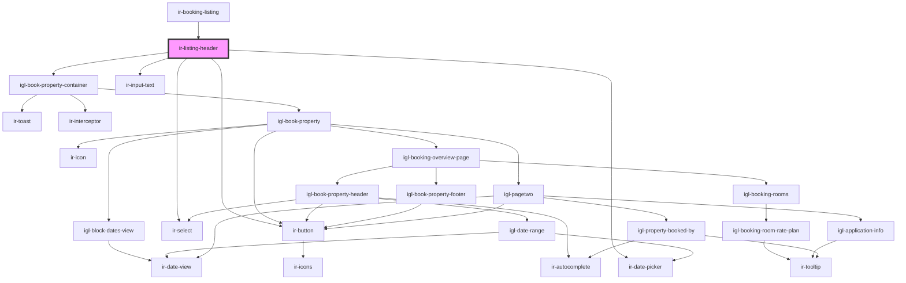

# ir-listing-header

<!-- Auto Generated Below -->

## Properties

| Property     | Attribute     | Description | Type     | Default     |
| ------------ | ------------- | ----------- | -------- | ----------- |
| `baseurl`    | `baseurl`     |             | `string` | `undefined` |
| `language`   | `language`    |             | `string` | `undefined` |
| `propertyId` | `property-id` |             | `number` | `undefined` |

## Events

| Event             | Description | Type                  |
| ----------------- | ----------- | --------------------- |
| `preventPageLoad` |             | `CustomEvent<string>` |

## Dependencies

### Used by

 - [ir-booking-listing](..)

### Depends on

- [igl-book-property-container](../../igl-book-property-container)
- [ir-button](../../ir-button)
- [ir-input-text](../../ir-input-text)
- [ir-select](../../ir-select)
- [ir-date-picker](../../ir-date-picker)

### Graph

----------------------------------------------

*Built with [StencilJS](https://stenciljs.com/)*
