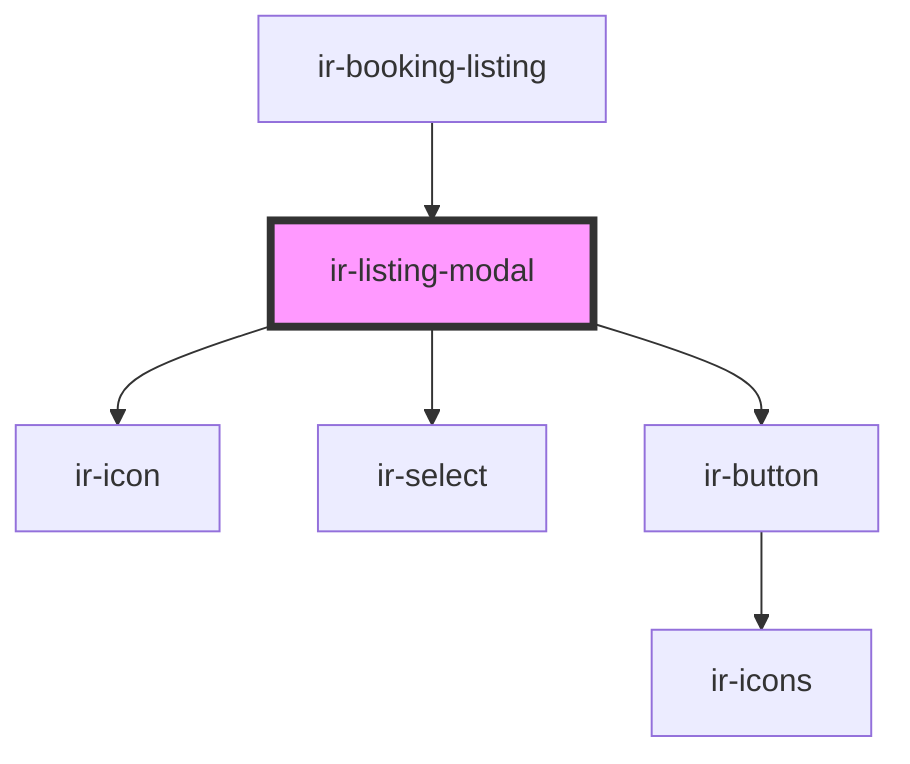

# ir-listing-modal

<!-- Auto Generated Below -->

## Properties

| Property      | Attribute     | Description | Type                                                                       | Default         |
| ------------- | ------------- | ----------- | -------------------------------------------------------------------------- | --------------- |
| `editBooking` | --            |             | `{ booking: Booking; cause: "guest" \| "delete" \| "payment" \| "edit"; }` | `undefined`     |
| `modalTitle`  | `modal-title` |             | `string`                                                                   | `'Modal Title'` |

## Events

| Event         | Description | Type                  |
| ------------- | ----------- | --------------------- |
| `modalClosed` |             | `CustomEvent<null>`   |
| `resetData`   |             | `CustomEvent<string>` |

## Methods

### `closeModal() => Promise<void>`

#### Returns

Type: `Promise<void>`

### `openModal() => Promise<void>`

#### Returns

Type: `Promise<void>`

## Dependencies

### Used by

 - [ir-booking-listing](..)

### Depends on

- [ir-icon](../../ir-icon)
- [ir-select](../../ir-select)
- [ir-button](../../ir-button)

### Graph

----------------------------------------------

*Built with [StencilJS](https://stenciljs.com/)*
