# ir-booking

<!-- Auto Generated Below -->

## Properties

| Property        | Attribute        | Description | Type     | Default     |
| --------------- | ---------------- | ----------- | -------- | ----------- |
| `bookingNumber` | `booking-number` |             | `string` | `undefined` |
| `p`             | `p`              |             | `string` | `undefined` |
| `propertyid`    | `propertyid`     |             | `number` | `undefined` |

## Dependencies

### Depends on

- [ir-login](../ir-login)
- [ir-booking-details](../ir-booking-details)

### Graph

```mermaid
graph TD;
  ir-booking --> ir-login
  ir-booking --> ir-booking-details
  ir-login --> ir-interceptor
  ir-login --> ir-toast
  ir-login --> ir-input-text
  ir-login --> ir-icons
  ir-login --> ir-button
  ir-button --> ir-icons
  ir-booking-details --> ir-guest-info
  ir-booking-details --> ir-pickup
  ir-booking-details --> ir-booking-extra-note
  ir-booking-details --> ir-spinner
  ir-booking-details --> ir-toast
  ir-booking-details --> ir-interceptor
  ir-booking-details --> ir-select
  ir-booking-details --> ir-button
  ir-booking-details --> ir-label
  ir-booking-details --> ota-label
  ir-booking-details --> ir-date-view
  ir-booking-details --> ir-room
  ir-booking-details --> ir-pickup-view
  ir-booking-details --> ir-payment-details
  ir-booking-details --> ir-sidebar
  ir-booking-details --> igl-book-property
  ir-booking-details --> ir-dialog
  ir-guest-info --> ir-icon
  ir-guest-info --> ir-input-text
  ir-guest-info --> ir-select
  ir-guest-info --> ir-button
  ir-pickup --> ir-title
  ir-pickup --> ir-select
  ir-pickup --> ir-date-picker
  ir-pickup --> ir-input-text
  ir-pickup --> ir-button
  ir-title --> ir-icon
  ir-booking-extra-note --> ir-title
  ir-booking-extra-note --> ir-textarea
  ir-booking-extra-note --> ir-button
  ir-label --> ir-button
  ir-room --> ir-button
  ir-room --> ir-date-view
  ir-room --> ir-label
  ir-room --> ir-modal
  ir-modal --> ir-button
  ir-pickup-view --> ir-button
  ir-payment-details --> ir-date-picker
  ir-payment-details --> ir-button
  ir-payment-details --> ir-modal
  ir-sidebar --> ir-icon
  igl-book-property --> igl-block-dates-view
  igl-book-property --> ir-button
  igl-book-property --> ir-icon
  igl-book-property --> igl-booking-overview-page
  igl-book-property --> igl-pagetwo
  igl-block-dates-view --> ir-date-view
  igl-booking-overview-page --> igl-book-property-header
  igl-booking-overview-page --> igl-booking-rooms
  igl-booking-overview-page --> igl-book-property-footer
  igl-book-property-header --> ir-autocomplete
  igl-book-property-header --> ir-select
  igl-book-property-header --> ir-button
  igl-book-property-header --> igl-date-range
  igl-date-range --> ir-date-picker
  igl-date-range --> ir-date-view
  igl-booking-rooms --> igl-booking-room-rate-plan
  igl-booking-room-rate-plan --> ir-tooltip
  igl-book-property-footer --> ir-button
  igl-pagetwo --> ir-date-view
  igl-pagetwo --> igl-application-info
  igl-pagetwo --> igl-property-booked-by
  igl-pagetwo --> ir-button
  igl-application-info --> ir-tooltip
  igl-property-booked-by --> ir-autocomplete
  igl-property-booked-by --> ir-tooltip
  ir-dialog --> ir-icon
  style ir-booking fill:#f9f,stroke:#333,stroke-width:4px
```

----------------------------------------------

*Built with [StencilJS](https://stenciljs.com/)*
