# ir-button

<!-- Auto Generated Below -->

## Properties

| Property                   | Attribute                     | Description | Type                                                                                                                                                                                                                                                                                                                                                                                                                                                                                                                                                                                                                                                                                                           | Default     |
| -------------------------- | ----------------------------- | ----------- | -------------------------------------------------------------------------------------------------------------------------------------------------------------------------------------------------------------------------------------------------------------------------------------------------------------------------------------------------------------------------------------------------------------------------------------------------------------------------------------------------------------------------------------------------------------------------------------------------------------------------------------------------------------------------------------------------------------- | ----------- |
| `btn_block`                | `btn_block`                   |             | `boolean`                                                                                                                                                                                                                                                                                                                                                                                                                                                                                                                                                                                                                                                                                                      | `true`      |
| `btn_color`                | `btn_color`                   |             | `"danger" \| "dark" \| "info" \| "light" \| "outline" \| "primary" \| "secondary" \| "success" \| "warning"`                                                                                                                                                                                                                                                                                                                                                                                                                                                                                                                                                                                                   | `'primary'` |
| `btn_disabled`             | `btn_disabled`                |             | `boolean`                                                                                                                                                                                                                                                                                                                                                                                                                                                                                                                                                                                                                                                                                                      | `false`     |
| `btn_id`                   | `btn_id`                      |             | `string`                                                                                                                                                                                                                                                                                                                                                                                                                                                                                                                                                                                                                                                                                                       | `v4()`      |
| `btn_styles`               | `btn_styles`                  |             | `string`                                                                                                                                                                                                                                                                                                                                                                                                                                                                                                                                                                                                                                                                                                       | `undefined` |
| `btn_type`                 | `btn_type`                    |             | `string`                                                                                                                                                                                                                                                                                                                                                                                                                                                                                                                                                                                                                                                                                                       | `'button'`  |
| `icon`                     | `icon`                        |             | `string`                                                                                                                                                                                                                                                                                                                                                                                                                                                                                                                                                                                                                                                                                                       | `'ft-save'` |
| `iconPostion`              | `icon-postion`                |             | `"left" \| "right"`                                                                                                                                                                                                                                                                                                                                                                                                                                                                                                                                                                                                                                                                                            | `'left'`    |
| `icon_name`                | `icon_name`                   |             | `"print" \| "key" \| "search" \| "save" \| "check" \| "user" \| "file" \| "edit" \| "danger" \| "clock" \| "heart-fill" \| "envelope-circle-check" \| "bell" \| "burger_menu" \| "home" \| "xmark" \| "minus" \| "heart" \| "user_group" \| "arrow_right" \| "arrow_left" \| "circle_info" \| "calendar" \| "xmark-fill" \| "globe" \| "facebook" \| "twitter" \| "whatsapp" \| "instagram" \| "youtube" \| "angle_left" \| "circle_check" \| "eraser" \| "trash" \| "plus" \| "reciept" \| "menu_list" \| "credit_card" \| "closed_eye" \| "open_eye" \| "server" \| "double_caret_left" \| "square_plus" \| "angles_left" \| "angle_right" \| "angles_right" \| "outline_user" \| "unlock" \| "circle_plus"` | `undefined` |
| `icon_style`               | `icon_style`                  |             | `any`                                                                                                                                                                                                                                                                                                                                                                                                                                                                                                                                                                                                                                                                                                          | `undefined` |
| `isLoading`                | `is-loading`                  |             | `boolean`                                                                                                                                                                                                                                                                                                                                                                                                                                                                                                                                                                                                                                                                                                      | `false`     |
| `name`                     | `name`                        |             | `string`                                                                                                                                                                                                                                                                                                                                                                                                                                                                                                                                                                                                                                                                                                       | `undefined` |
| `size`                     | `size`                        |             | `"lg" \| "md" \| "sm"`                                                                                                                                                                                                                                                                                                                                                                                                                                                                                                                                                                                                                                                                                         | `'md'`      |
| `text`                     | `text`                        |             | `any`                                                                                                                                                                                                                                                                                                                                                                                                                                                                                                                                                                                                                                                                                                          | `undefined` |
| `textSize`                 | `text-size`                   |             | `"lg" \| "md" \| "sm"`                                                                                                                                                                                                                                                                                                                                                                                                                                                                                                                                                                                                                                                                                         | `'md'`      |
| `variant`                  | `variant`                     |             | `"default" \| "icon"`                                                                                                                                                                                                                                                                                                                                                                                                                                                                                                                                                                                                                                                                                          | `'default'` |
| `visibleBackgroundOnHover` | `visible-background-on-hover` |             | `boolean`                                                                                                                                                                                                                                                                                                                                                                                                                                                                                                                                                                                                                                                                                                      | `false`     |

## Events

| Event          | Description | Type               |
| -------------- | ----------- | ------------------ |
| `clickHandler` |             | `CustomEvent<any>` |

## Dependencies

### Used by

 - [igl-book-property](../igloo-calendar/igl-book-property)
 - [igl-book-property-footer](../igloo-calendar/igl-book-property/igl-book-property-footer)
 - [igl-book-property-header](../igloo-calendar/igl-book-property/igl-book-property-header)
 - [igl-booking-form](../igloo-calendar/igl-book-property/igl-booking-form)
 - [igl-cal-header](../igloo-calendar/igl-cal-header)
 - [igl-tba-booking-view](../igloo-calendar/igl-to-be-assigned/igl-tba-booking-view)
 - [igl-to-be-assigned](../igloo-calendar/igl-to-be-assigned)
 - [ir-booking-details](../ir-booking-details)
 - [ir-booking-extra-note](../ir-booking-details/ir-booking-extra-note)
 - [ir-booking-header](../ir-booking-details/ir-booking-header)
 - [ir-booking-listing](../ir-booking-listing)
 - [ir-channel](../ir-channel)
 - [ir-channel-editor](../ir-channel/ir-channel-editor)
 - [ir-channel-mapping](../ir-channel/ir-channel-mapping)
 - [ir-delete-modal](../ir-housekeeping/ir-delete-modal)
 - [ir-extra-service](../ir-booking-details/ir-extra-services/ir-extra-service)
 - [ir-extra-service-config](../ir-booking-details/ir-extra-services/ir-extra-service-config)
 - [ir-guest-info](../ir-guest-info)
 - [ir-hk-tasks](../ir-housekeeping/ir-hk-tasks)
 - [ir-hk-unassigned-units](../ir-housekeeping/ir-hk-unassigned-units)
 - [ir-hk-user](../ir-housekeeping/ir-hk-user)
 - [ir-listing-header](../ir-booking-listing/ir-listing-header)
 - [ir-listing-modal](../ir-booking-listing/ir-listing-modal)
 - [ir-login](../ir-login)
 - [ir-modal](../ir-modal)
 - [ir-option-details](../ir-payment-option/ir-option-details)
 - [ir-payment-actions](../ir-booking-details/ir-payment-details/ir-payment-actions)
 - [ir-payment-details](../ir-booking-details/ir-payment-details)
 - [ir-payment-option](../ir-payment-option)
 - [ir-pickup](../ir-booking-details/ir-pickup)
 - [ir-pickup-view](../ir-booking-details/ir-pickup-view)
 - [ir-reservation-information](../ir-booking-details/ir-reservation-information)
 - [ir-room](../ir-booking-details/ir-room)
 - [ir-room-nights](../igloo-calendar/ir-room-nights)

### Depends on

- [ir-icons](../ui/ir-icons)

### Graph

```mermaid
graph TD;
  ir-button --> ir-icons
  igl-book-property --> ir-button
  igl-book-property-footer --> ir-button
  igl-book-property-header --> ir-button
  igl-booking-form --> ir-button
  igl-cal-header --> ir-button
  igl-tba-booking-view --> ir-button
  igl-to-be-assigned --> ir-button
  ir-booking-details --> ir-button
  ir-booking-extra-note --> ir-button
  ir-booking-header --> ir-button
  ir-booking-listing --> ir-button
  ir-channel --> ir-button
  ir-channel-editor --> ir-button
  ir-channel-mapping --> ir-button
  ir-delete-modal --> ir-button
  ir-extra-service --> ir-button
  ir-extra-service-config --> ir-button
  ir-guest-info --> ir-button
  ir-hk-tasks --> ir-button
  ir-hk-unassigned-units --> ir-button
  ir-hk-user --> ir-button
  ir-listing-header --> ir-button
  ir-listing-modal --> ir-button
  ir-login --> ir-button
  ir-modal --> ir-button
  ir-option-details --> ir-button
  ir-payment-actions --> ir-button
  ir-payment-details --> ir-button
  ir-payment-option --> ir-button
  ir-pickup --> ir-button
  ir-pickup-view --> ir-button
  ir-reservation-information --> ir-button
  ir-room --> ir-button
  ir-room-nights --> ir-button
  style ir-button fill:#f9f,stroke:#333,stroke-width:4px
```

----------------------------------------------

*Built with [StencilJS](https://stenciljs.com/)*
