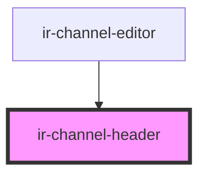

# ir-channel-header

<!-- Auto Generated Below -->

## Properties

| Property       | Attribute | Description | Type                                                 | Default |
| -------------- | --------- | ----------- | ---------------------------------------------------- | ------- |
| `headerTitles` | --        |             | `{ id: string; name: string; disabled: boolean; }[]` | `[]`    |

## Events

| Event        | Description | Type                  |
| ------------ | ----------- | --------------------- |
| `tabChanged` |             | `CustomEvent<string>` |

## Dependencies

### Used by

 - [ir-channel-editor](../ir-channel-editor)

### Graph

----------------------------------------------

*Built with [StencilJS](https://stenciljs.com/)*
