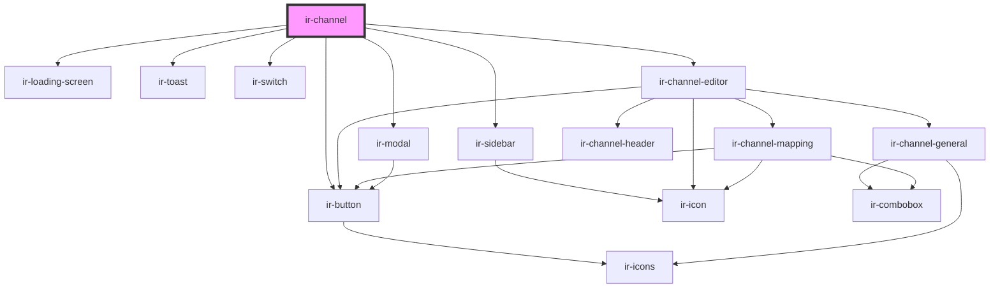

# ir-channel

<!-- Auto Generated Below -->

## Properties

| Property     | Attribute    | Description | Type     | Default     |
| ------------ | ------------ | ----------- | -------- | ----------- |
| `baseurl`    | `baseurl`    |             | `string` | `undefined` |
| `language`   | `language`   |             | `string` | `undefined` |
| `p`          | `p`          |             | `string` | `undefined` |
| `propertyid` | `propertyid` |             | `number` | `undefined` |
| `ticket`     | `ticket`     |             | `string` | `''`        |

## Dependencies

### Depends on

- [ir-loading-screen](../ir-loading-screen)
- [ir-toast](../ir-toast)
- [ir-button](../ir-button)
- [ir-switch](../ir-switch)
- [ir-sidebar](../ir-sidebar)
- [ir-channel-editor](ir-channel-editor)
- [ir-modal](../ir-modal)

### Graph

----------------------------------------------

*Built with [StencilJS](https://stenciljs.com/)*
