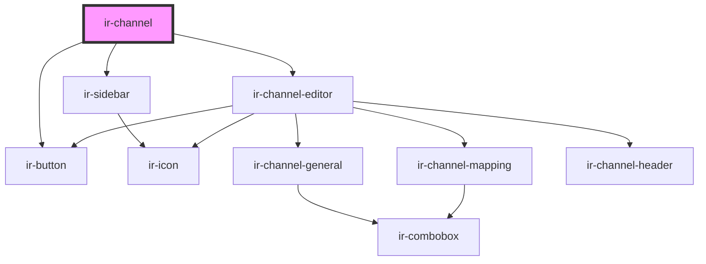

# ir-channel

<!-- Auto Generated Below -->

## Properties

| Property     | Attribute    | Description | Type     | Default     |
| ------------ | ------------ | ----------- | -------- | ----------- |
| `baseurl`    | `baseurl`    |             | `string` | `undefined` |
| `language`   | `language`   |             | `string` | `undefined` |
| `propertyid` | `propertyid` |             | `number` | `undefined` |
| `ticket`     | `ticket`     |             | `string` | `''`        |

## Dependencies

### Depends on

- [ir-button](../ir-button)
- [ir-sidebar](../ir-sidebar)
- [ir-channel-editor](ir-channel-editor)

### Graph

```mermaid
graph TD;
  ir-channel --> ir-button
  ir-channel --> ir-sidebar
  ir-channel --> ir-channel-editor
  ir-sidebar --> ir-icon
  ir-channel-editor --> ir-channel-general
  ir-channel-editor --> ir-channel-mapping
  ir-channel-editor --> ir-icon
  ir-channel-editor --> ir-channel-header
  ir-channel-editor --> ir-button
  ir-channel-general --> ir-combobox
  ir-channel-mapping --> ir-combobox
  style ir-channel fill:#f9f,stroke:#333,stroke-width:4px
```

----------------------------------------------

*Built with [StencilJS](https://stenciljs.com/)*
