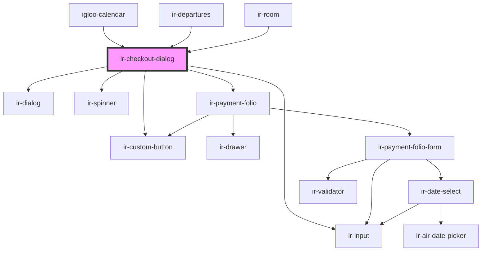

# ir-checkout-dialog

<!-- Auto Generated Below -->

## Properties

| Property     | Attribute    | Description | Type      | Default     |
| ------------ | ------------ | ----------- | --------- | ----------- |
| `booking`    | --           |             | `Booking` | `undefined` |
| `identifier` | `identifier` |             | `string`  | `undefined` |
| `open`       | `open`       |             | `boolean` | `undefined` |

## Events

| Event                  | Description | Type                                                                |
| ---------------------- | ----------- | ------------------------------------------------------------------- |
| `checkoutDialogClosed` |             | `CustomEvent<{ reason: "cancel" \| "checkout" \| "openInvoice"; }>` |

## Dependencies

### Used by

 - [igloo-calendar](../igloo-calendar)
 - [ir-departures](../ir-departures)
 - [ir-room](../ir-booking-details/ir-room)

### Depends on

- [ir-input](../ui/ir-input)
- [ir-dialog](../ui/ir-dialog)
- [ir-spinner](../ui/ir-spinner)
- [ir-custom-button](../ui/ir-custom-button)
- [ir-payment-folio](../ir-booking-details/ir-payment-details/ir-payment-folio)

### Graph

```mermaid
graph TD;
  ir-checkout-dialog --> ir-input
  ir-checkout-dialog --> ir-dialog
  ir-checkout-dialog --> ir-spinner
  ir-checkout-dialog --> ir-custom-button
  ir-checkout-dialog --> ir-payment-folio
  ir-payment-folio --> ir-drawer
  ir-payment-folio --> ir-payment-folio-form
  ir-payment-folio --> ir-custom-button
  ir-payment-folio-form --> ir-date-select
  ir-payment-folio-form --> ir-validator
  ir-payment-folio-form --> ir-input
  ir-date-select --> ir-input
  ir-date-select --> ir-air-date-picker
  igloo-calendar --> ir-checkout-dialog
  ir-departures --> ir-checkout-dialog
  ir-room --> ir-checkout-dialog
  style ir-checkout-dialog fill:#f9f,stroke:#333,stroke-width:4px
```

----------------------------------------------

*Built with [StencilJS](https://stenciljs.com/)*
