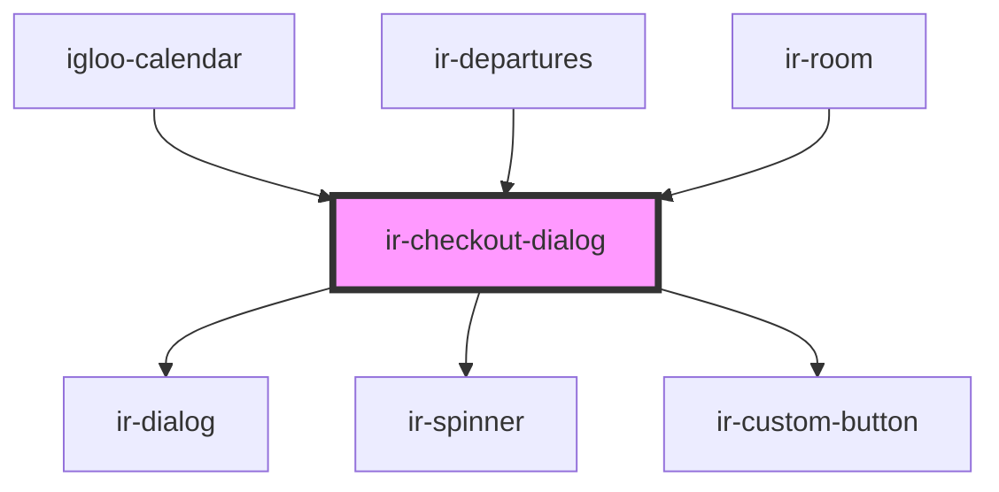

# ir-checkout-dialog

<!-- Auto Generated Below -->

## Properties

| Property     | Attribute    | Description                                        | Type      | Default     |
| ------------ | ------------ | -------------------------------------------------- | --------- | ----------- |
| `booking`    | --           | Booking data for the current room checkout action. | `Booking` | `undefined` |
| `identifier` | `identifier` | Unique identifier of the room being checked out.   | `string`  | `undefined` |
| `open`       | `open`       |                                                    | `boolean` | `undefined` |

## Events

| Event                  | Description | Type                                                                |
| ---------------------- | ----------- | ------------------------------------------------------------------- |
| `checkoutDialogClosed` |             | `CustomEvent<{ reason: "cancel" \| "checkout" \| "openInvoice"; }>` |

## Dependencies

### Used by

 - [igloo-calendar](../igloo-calendar)
 - [ir-departures](../ir-departures)
 - [ir-room](../ir-booking-details/ir-room)

### Depends on

- [ir-dialog](../ui/ir-dialog)
- [ir-spinner](../ui/ir-spinner)
- [ir-custom-button](../ui/ir-custom-button)

### Graph

----------------------------------------------

*Built with [StencilJS](https://stenciljs.com/)*
