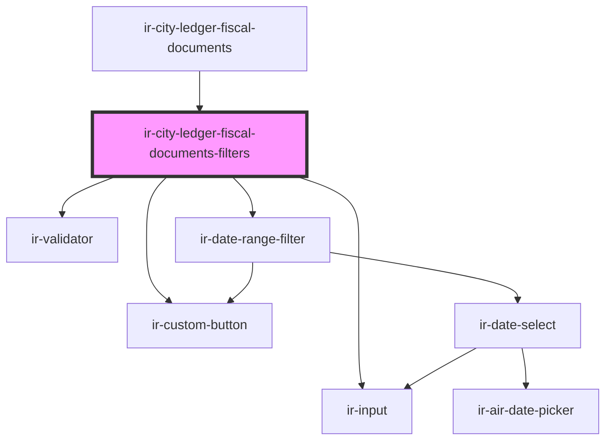

# ir-city-ledger-fiscal-documents-filters

<!-- Auto Generated Below -->

## Properties

| Property  | Attribute | Description | Type                      | Default                                                                                                                                      |
| --------- | --------- | ----------- | ------------------------- | -------------------------------------------------------------------------------------------------------------------------------------------- |
| `filters` | --        |             | `ClFiscalDocumentFilters` | `{     fromDate: undefined,     toDate: undefined,     docNumber: '',     taxableOnly: false,     type: 'all',     proformaOnly: false,   }` |

## Events

| Event           | Description | Type                                   |
| --------------- | ----------- | -------------------------------------- |
| `applyFilters`  |             | `CustomEvent<ClFiscalDocumentFilters>` |
| `filtersChange` |             | `CustomEvent<ClFiscalDocumentFilters>` |

## Dependencies

### Used by

 - [ir-city-ledger-fiscal-documents](..)

### Depends on

- [ir-validator](../../../ui/ir-validator)
- [ir-date-range-filter](../../../ui/ir-date-range-filter)
- [ir-input](../../../ui/ir-input)
- [ir-custom-button](../../../ui/ir-custom-button)

### Graph

----------------------------------------------

*Built with [StencilJS](https://stenciljs.com/)*
