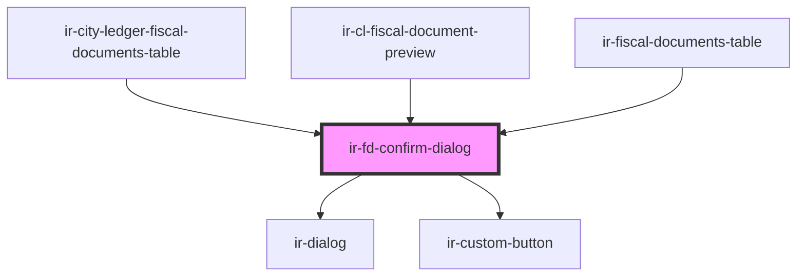

# ir-fd-confirm-dialog

<!-- Auto Generated Below -->

## Properties

| Property       | Attribute       | Description | Type                                               | Default           |
| -------------- | --------------- | ----------- | -------------------------------------------------- | ----------------- |
| `action`       | `action`        |             | `"convert-to-invoice" \| "delete-draft" \| "void"` | `null`            |
| `docNumber`    | `doc-number`    |             | `string`                                           | `'this document'` |
| `fdType`       | `fd-type`       |             | `string`                                           | `undefined`       |
| `isConfirming` | `is-confirming` |             | `boolean`                                          | `false`           |
| `open`         | `open`          |             | `boolean`                                          | `false`           |

## Events

| Event       | Description | Type                |
| ----------- | ----------- | ------------------- |
| `cancelled` |             | `CustomEvent<void>` |
| `confirmed` |             | `CustomEvent<void>` |

## Dependencies

### Used by

 - [ir-city-ledger-fiscal-documents-table](..)
 - [ir-cl-fiscal-document-preview](../../ir-cl-fiscal-document-preview)
 - [ir-fiscal-documents-table](../../../../ir-fiscal-documents/ir-fiscal-documents-table)

### Depends on

- [ir-dialog](../../../../ui/ir-dialog)
- [ir-custom-button](../../../../ui/ir-custom-button)

### Graph

----------------------------------------------

*Built with [StencilJS](https://stenciljs.com/)*
