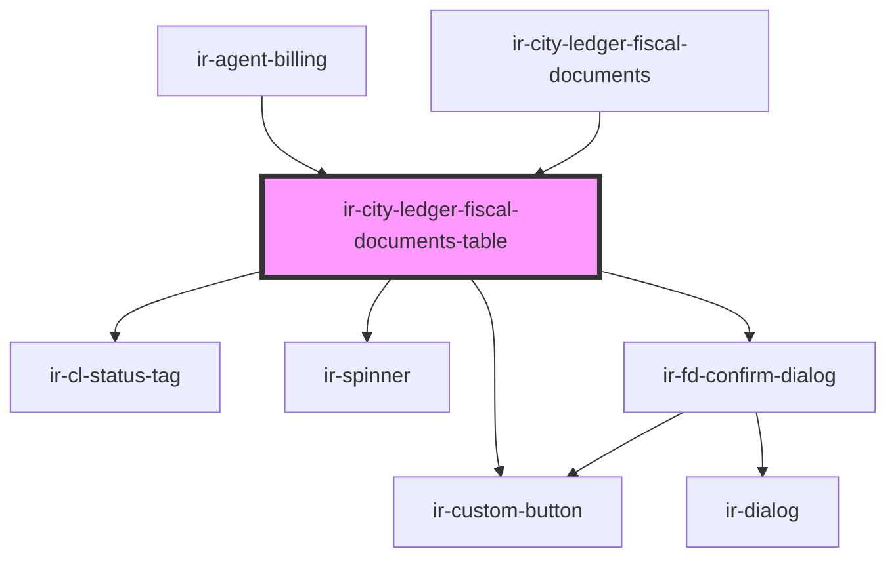

# ir-city-ledger-fiscal-documents-table

<!-- Auto Generated Below -->

## Properties

| Property         | Attribute         | Description | Type                                                                                                                                                                                                                                                                                                                                                                                                                                                                                                                                                                                                                                                             | Default     |
| ---------------- | ----------------- | ----------- | ---------------------------------------------------------------------------------------------------------------------------------------------------------------------------------------------------------------------------------------------------------------------------------------------------------------------------------------------------------------------------------------------------------------------------------------------------------------------------------------------------------------------------------------------------------------------------------------------------------------------------------------------------------------- | ----------- |
| `agentId`        | `agent-id`        |             | `number`                                                                                                                                                                                                                                                                                                                                                                                                                                                                                                                                                                                                                                                         | `null`      |
| `currencies`     | --                |             | `ICurrency[]`                                                                                                                                                                                                                                                                                                                                                                                                                                                                                                                                                                                                                                                    | `[]`        |
| `currencySymbol` | `currency-symbol` |             | `string`                                                                                                                                                                                                                                                                                                                                                                                                                                                                                                                                                                                                                                                         | `'$'`       |
| `fromDate`       | `from-date`       |             | `string`                                                                                                                                                                                                                                                                                                                                                                                                                                                                                                                                                                                                                                                         | `null`      |
| `hasDates`       | `has-dates`       |             | `boolean`                                                                                                                                                                                                                                                                                                                                                                                                                                                                                                                                                                                                                                                        | `false`     |
| `hasFetched`     | `has-fetched`     |             | `boolean`                                                                                                                                                                                                                                                                                                                                                                                                                                                                                                                                                                                                                                                        | `false`     |
| `isLoading`      | `is-loading`      |             | `boolean`                                                                                                                                                                                                                                                                                                                                                                                                                                                                                                                                                                                                                                                        | `false`     |
| `propertyId`     | `property-id`     |             | `number`                                                                                                                                                                                                                                                                                                                                                                                                                                                                                                                                                                                                                                                         | `undefined` |
| `rows`           | --                |             | `{ FROM_DATE?: string; TO_DATE?: string; BOOK_NBR?: string; AGENCY_ID?: number; CURRENCY_ID?: number; AGENCY_NAME?: string; CREDIT?: number; CREDIT_DISPLAY?: string; CURRENCY_CODE?: string; DEBIT?: number; DEBIT_DISPLAY?: string; DOC_NUMBER?: string; EXTERNAL_REF?: string; FD_ID?: number; FD_STATUS_CODE?: string; FD_STATUS_NAME?: string; FD_TYPE_CODE?: string; FD_TYPE_NAME?: string; ISSUE_DATE?: string; ISSUE_DATE_DISPLAY?: string; IS_PRINTED?: boolean; NET_AMOUNT?: number; NET_AMOUNT_DISPLAY?: string; TAX_AMOUNT?: number; TAX_AMOUNT_DISPLAY?: string; TOTAL_AMOUNT?: number; BALANCE_BEFORE_TX?: number; BALANCE_AFTER_TX?: number; }[]` | `[]`        |
| `taxableOnly`    | `taxable-only`    |             | `boolean`                                                                                                                                                                                                                                                                                                                                                                                                                                                                                                                                                                                                                                                        | `false`     |
| `ticket`         | `ticket`          |             | `string`                                                                                                                                                                                                                                                                                                                                                                                                                                                                                                                                                                                                                                                         | `undefined` |
| `toDate`         | `to-date`         |             | `string`                                                                                                                                                                                                                                                                                                                                                                                                                                                                                                                                                                                                                                                         | `null`      |

## Events

| Event                     | Description | Type                                          |
| ------------------------- | ----------- | --------------------------------------------- |
| `clFiscalDocumentPreview` |             | `CustomEvent<ClFiscalDocumentPreviewRequest>` |
| `fetchRequested`          |             | `CustomEvent<void>`                           |

## Dependencies

### Used by

 - [ir-agent-billing](../../../ir-billing/ir-agent-billing)
 - [ir-city-ledger-fiscal-documents](..)

### Depends on

- [ir-cl-status-tag](../../ir-cl-status-tag)
- [ir-custom-button](../../../ui/ir-custom-button)
- [ir-spinner](../../../ui/ir-spinner)
- [ir-fd-confirm-dialog](ir-fd-confirm-dialog)

### Graph

----------------------------------------------

*Built with [StencilJS](https://stenciljs.com/)*
