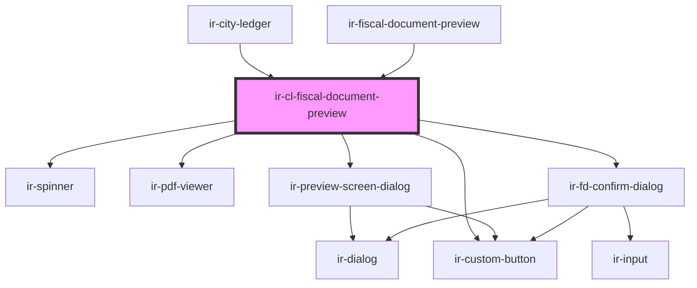

# ir-cl-fiscal-document-preview

<!-- Auto Generated Below -->

## Properties

| Property     | Attribute     | Description | Type     | Default     |
| ------------ | ------------- | ----------- | -------- | ----------- |
| `propertyId` | `property-id` |             | `number` | `undefined` |
| `ticket`     | `ticket`      |             | `string` | `undefined` |

## Events

| Event               | Description | Type                |
| ------------------- | ----------- | ------------------- |
| `documentConverted` |             | `CustomEvent<void>` |

## Dependencies

### Used by

 - [ir-city-ledger](../..)
 - [ir-fiscal-document-preview](../../../ir-fiscal-documents/ir-fiscal-document-preview)

### Depends on

- [ir-spinner](../../../ui/ir-spinner)
- [ir-pdf-viewer](../../../ir-pdf-viewer)
- [ir-preview-screen-dialog](../../../ir-preview-screen-dialog)
- [ir-custom-button](../../../ui/ir-custom-button)
- [ir-fd-confirm-dialog](../ir-city-ledger-fiscal-documents-table/ir-fd-confirm-dialog)

### Graph

----------------------------------------------

*Built with [StencilJS](https://stenciljs.com/)*
