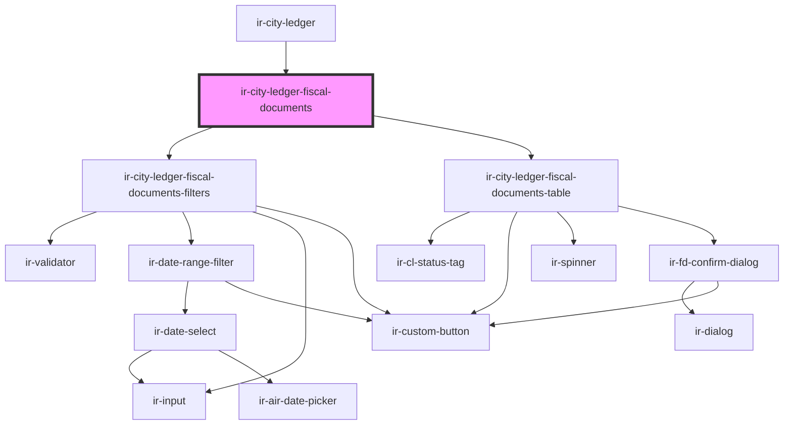

# ir-city-ledger-fiscal-documents

<!-- Auto Generated Below -->

## Properties

| Property         | Attribute         | Description | Type                      | Default     |
| ---------------- | ----------------- | ----------- | ------------------------- | ----------- |
| `agentId`        | `agent-id`        |             | `number`                  | `null`      |
| `currencies`     | --                |             | `ICurrency[]`             | `[]`        |
| `currencySymbol` | `currency-symbol` |             | `string`                  | `'$'`       |
| `initialFilters` | --                |             | `ClFiscalDocumentFilters` | `undefined` |
| `propertyId`     | `property-id`     |             | `number`                  | `undefined` |
| `ticket`         | `ticket`          |             | `string`                  | `undefined` |

## Events

| Event                   | Description | Type                                   |
| ----------------------- | ----------- | -------------------------------------- |
| `clFiscalFiltersChange` |             | `CustomEvent<ClFiscalDocumentFilters>` |

## Dependencies

### Used by

 - [ir-city-ledger](..)

### Depends on

- [ir-city-ledger-fiscal-documents-filters](ir-city-ledger-fiscal-documents-filters)
- [ir-city-ledger-fiscal-documents-table](ir-city-ledger-fiscal-documents-table)

### Graph

----------------------------------------------

*Built with [StencilJS](https://stenciljs.com/)*
