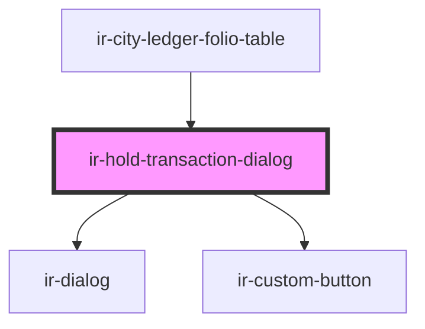

# ir-hold-transaction-dialog

<!-- Auto Generated Below -->

## Properties

| Property         | Attribute         | Description | Type       | Default |
| ---------------- | ----------------- | ----------- | ---------- | ------- |
| `currencySymbol` | `currency-symbol` |             | `string`   | `'$'`   |
| `row`            | --                |             | `FolioRow` | `null`  |

## Events

| Event         | Description | Type                                                  |
| ------------- | ----------- | ----------------------------------------------------- |
| `holdToggled` |             | `CustomEvent<{ rowId: string; newIsHold: boolean; }>` |

## Methods

### `closeModal() => Promise<void>`

#### Returns

Type: `Promise<void>`

### `openModal() => Promise<void>`

#### Returns

Type: `Promise<void>`

## Dependencies

### Used by

 - [ir-city-ledger-folio-table](..)

### Depends on

- [ir-dialog](../../../../ui/ir-dialog)
- [ir-custom-button](../../../../ui/ir-custom-button)

### Graph

----------------------------------------------

*Built with [StencilJS](https://stenciljs.com/)*
