# ir-city-ledger-folio-table

<!-- Auto Generated Below -->

## Properties

| Property          | Attribute           | Description | Type          | Default     |
| ----------------- | ------------------- | ----------- | ------------- | ----------- |
| `agentId`         | `agent-id`          |             | `number`      | `null`      |
| `closingBalance`  | `closing-balance`   |             | `number`      | `0`         |
| `currencies`      | --                  |             | `ICurrency[]` | `[]`        |
| `currencySymbol`  | `currency-symbol`   |             | `string`      | `'$'`       |
| `data`            | --                  |             | `FolioRow[]`  | `[]`        |
| `fromDate`        | `from-date`         |             | `string`      | `''`        |
| `hasFetched`      | `has-fetched`       |             | `boolean`     | `false`     |
| `hideBalanceInfo` | `hide-balance-info` |             | `boolean`     | `false`     |
| `isLoading`       | `is-loading`        |             | `boolean`     | `false`     |
| `language`        | `language`          |             | `string`      | `'en'`      |
| `pageIndex`       | `page-index`        |             | `number`      | `0`         |
| `pageSize`        | `page-size`         |             | `number`      | `25`        |
| `propertyId`      | `property-id`       |             | `number`      | `undefined` |
| `startingBalance` | `starting-balance`  |             | `number`      | `0`         |
| `ticket`          | `ticket`            |             | `string`      | `undefined` |
| `toDate`          | `to-date`           |             | `string`      | `''`        |
| `totalCount`      | `total-count`       |             | `number`      | `0`         |

## Events

| Event             | Description | Type                                                                                                                                                                                                                                                                                                                                                                                                                                                                                                                                                                                                                                                                                                                                                                                                                                                                                                                                                                                                                                                                                                                                                                                                                                                                                                                                                                                                                                                                                                                                                                                                                                                                                                                                                                                                 |
| ----------------- | ----------- | ---------------------------------------------------------------------------------------------------------------------------------------------------------------------------------------------------------------------------------------------------------------------------------------------------------------------------------------------------------------------------------------------------------------------------------------------------------------------------------------------------------------------------------------------------------------------------------------------------------------------------------------------------------------------------------------------------------------------------------------------------------------------------------------------------------------------------------------------------------------------------------------------------------------------------------------------------------------------------------------------------------------------------------------------------------------------------------------------------------------------------------------------------------------------------------------------------------------------------------------------------------------------------------------------------------------------------------------------------------------------------------------------------------------------------------------------------------------------------------------------------------------------------------------------------------------------------------------------------------------------------------------------------------------------------------------------------------------------------------------------------------------------------------------------------- |
| `deleteEntry`     |             | `CustomEvent<{ PR_ID?: number; ENTRY_DATE?: string; ENTRY_USER_ID?: number; OWNER_ID?: number; DOC_NUMBER?: string; CURRENCY_ID?: number; TOTAL_AMOUNT?: number; CREDIT?: number; DEBIT?: number; NET_AMOUNT?: number; TAX_AMOUNT?: number; FROM_DATE?: string; TO_DATE?: string; BOOK_NBR?: string; EXTERNAL_REF?: string; FD_ID?: number; BH_ID?: number; BSA_REF?: string; CATEGORY?: string; AGENT_BOOKING_NBR?: string; ADULTS_NBR?: number; CHILD_NBR?: number; INFANT_NBR?: number; GUEST_FIRST_NAME?: string; GUEST_LAST_NAME?: string; ROOM_CATEGORY_ID?: number; ROOM_TYPE_ID?: number; RATE_PLAN_ID?: number; SERVICE_DATE?: string; CITY_TAX_AMOUNT?: number; CITY_TAX_PERCENT?: number; CL_TX_ID?: number; CL_TX_TYPE_CODE?: string; DESCRIPTION?: string; IS_HOLD?: boolean; IS_LOCKED?: boolean; My_Bh?: any; My_Currency?: any; My_Fd?: { DOC_NUMBER?: string; FD_TYPE_CODE?: string; CURRENCY_ID?: number; TOTAL_AMOUNT?: number; CREDIT?: number; DEBIT?: number; NET_AMOUNT?: number; TAX_AMOUNT?: number; FROM_DATE?: string; TO_DATE?: string; BOOK_NBR?: string; AGENCY_ID?: number; AGENCY_NAME?: string; CREDIT_DISPLAY?: string; CURRENCY_CODE?: string; DEBIT_DISPLAY?: string; EXTERNAL_REF?: string; FD_ID?: number; FD_STATUS_CODE?: string; FD_STATUS_NAME?: string; FD_TYPE_NAME?: string; ISSUE_DATE?: string; ISSUE_DATE_DISPLAY?: string; IS_PRINTED?: boolean; NET_AMOUNT_DISPLAY?: string; TAX_AMOUNT_DISPLAY?: string; BALANCE_BEFORE_TX?: number; BALANCE_AFTER_TX?: number; }; My_Pr?: any; My_Room_category?: any; RUNNING_BALANCE?: number; My_Room_type?: any; My_Travel_agency?: null; PAY_METHOD_CODE?: string; REL_ENTITY?: "TBL_BSAD" \| "TBL_BSP"; REL_ENTITY_KEY?: number; TRAVEL_AGENCY_ID?: number; VAT_AMOUNT?: number; VAT_PERCENT?: number; }>` |
| `editEntry`       |             | `CustomEvent<{ PR_ID?: number; ENTRY_DATE?: string; ENTRY_USER_ID?: number; OWNER_ID?: number; DOC_NUMBER?: string; CURRENCY_ID?: number; TOTAL_AMOUNT?: number; CREDIT?: number; DEBIT?: number; NET_AMOUNT?: number; TAX_AMOUNT?: number; FROM_DATE?: string; TO_DATE?: string; BOOK_NBR?: string; EXTERNAL_REF?: string; FD_ID?: number; BH_ID?: number; BSA_REF?: string; CATEGORY?: string; AGENT_BOOKING_NBR?: string; ADULTS_NBR?: number; CHILD_NBR?: number; INFANT_NBR?: number; GUEST_FIRST_NAME?: string; GUEST_LAST_NAME?: string; ROOM_CATEGORY_ID?: number; ROOM_TYPE_ID?: number; RATE_PLAN_ID?: number; SERVICE_DATE?: string; CITY_TAX_AMOUNT?: number; CITY_TAX_PERCENT?: number; CL_TX_ID?: number; CL_TX_TYPE_CODE?: string; DESCRIPTION?: string; IS_HOLD?: boolean; IS_LOCKED?: boolean; My_Bh?: any; My_Currency?: any; My_Fd?: { DOC_NUMBER?: string; FD_TYPE_CODE?: string; CURRENCY_ID?: number; TOTAL_AMOUNT?: number; CREDIT?: number; DEBIT?: number; NET_AMOUNT?: number; TAX_AMOUNT?: number; FROM_DATE?: string; TO_DATE?: string; BOOK_NBR?: string; AGENCY_ID?: number; AGENCY_NAME?: string; CREDIT_DISPLAY?: string; CURRENCY_CODE?: string; DEBIT_DISPLAY?: string; EXTERNAL_REF?: string; FD_ID?: number; FD_STATUS_CODE?: string; FD_STATUS_NAME?: string; FD_TYPE_NAME?: string; ISSUE_DATE?: string; ISSUE_DATE_DISPLAY?: string; IS_PRINTED?: boolean; NET_AMOUNT_DISPLAY?: string; TAX_AMOUNT_DISPLAY?: string; BALANCE_BEFORE_TX?: number; BALANCE_AFTER_TX?: number; }; My_Pr?: any; My_Room_category?: any; RUNNING_BALANCE?: number; My_Room_type?: any; My_Travel_agency?: null; PAY_METHOD_CODE?: string; REL_ENTITY?: "TBL_BSAD" \| "TBL_BSP"; REL_ENTITY_KEY?: number; TRAVEL_AGENCY_ID?: number; VAT_AMOUNT?: number; VAT_PERCENT?: number; }>` |
| `fetchRequested`  |             | `CustomEvent<void>`                                                                                                                                                                                                                                                                                                                                                                                                                                                                                                                                                                                                                                                                                                                                                                                                                                                                                                                                                                                                                                                                                                                                                                                                                                                                                                                                                                                                                                                                                                                                                                                                                                                                                                                                                                                  |
| `generateInvoice` |             | `CustomEvent<FolioRow[]>`                                                                                                                                                                                                                                                                                                                                                                                                                                                                                                                                                                                                                                                                                                                                                                                                                                                                                                                                                                                                                                                                                                                                                                                                                                                                                                                                                                                                                                                                                                                                                                                                                                                                                                                                                                            |
| `pageChange`      |             | `CustomEvent<{ pageIndex: number; pageSize: number; }>`                                                                                                                                                                                                                                                                                                                                                                                                                                                                                                                                                                                                                                                                                                                                                                                                                                                                                                                                                                                                                                                                                                                                                                                                                                                                                                                                                                                                                                                                                                                                                                                                                                                                                                                                              |

## Dependencies

### Used by

 - [ir-city-ledger-folio](..)

### Depends on

- [ir-cl-status-tag](../../ir-cl-status-tag)
- [ir-custom-button](../../../ui/ir-custom-button)
- [ir-input-cell](../../../ir-table/ir-input-cell)
- [ir-empty-state](../../../ir-empty-state)
- [ir-spinner](../../../ui/ir-spinner)
- [ir-pagination](../../../ir-pagination)
- [ir-hold-transaction-dialog](ir-hold-transaction-dialog)
- [ir-booking-details-drawer](../../../ir-booking-details/ir-booking-details-drawer)

### Graph

```mermaid
graph TD;
  ir-city-ledger-folio-table --> ir-cl-status-tag
  ir-city-ledger-folio-table --> ir-custom-button
  ir-city-ledger-folio-table --> ir-input-cell
  ir-city-ledger-folio-table --> ir-empty-state
  ir-city-ledger-folio-table --> ir-spinner
  ir-city-ledger-folio-table --> ir-pagination
  ir-city-ledger-folio-table --> ir-hold-transaction-dialog
  ir-city-ledger-folio-table --> ir-booking-details-drawer
  ir-input-cell --> ir-input
  ir-pagination --> ir-custom-button
  ir-hold-transaction-dialog --> ir-dialog
  ir-hold-transaction-dialog --> ir-custom-button
  ir-booking-details-drawer --> ir-drawer
  ir-booking-details-drawer --> ir-booking-details
  ir-booking-details --> ir-spinner
  ir-booking-details --> ir-toast
  ir-booking-details --> ir-interceptor
  ir-booking-details --> ir-booking-header
  ir-booking-details --> ir-reservation-information
  ir-booking-details --> ir-booking-rooms
  ir-booking-details --> ir-extra-services
  ir-booking-details --> ir-pickup-view
  ir-booking-details --> ir-payment-details
  ir-booking-details --> ir-dialog
  ir-booking-details --> ir-custom-button
  ir-booking-details --> ir-room-guests
  ir-booking-details --> ir-extra-service-config
  ir-booking-details --> ir-pickup
  ir-booking-details --> ir-billing-drawer
  ir-booking-details --> ir-guest-info-drawer
  ir-booking-details --> ir-payment-folio
  ir-booking-details --> ir-booking-editor-drawer
  ir-booking-details --> ir-fiscal-document-preview
  ir-toast --> ir-toast-provider
  ir-toast-provider --> ir-toast-item
  ir-interceptor --> ir-otp-modal
  ir-otp-modal --> ir-spinner
  ir-otp-modal --> ir-otp
  ir-otp-modal --> ir-button
  ir-button --> ir-icons
  ir-booking-header --> ir-pms-logs
  ir-booking-header --> ir-events-log
  ir-booking-header --> ir-custom-button
  ir-booking-header --> ir-booking-status-tag
  ir-booking-header --> ir-dialog
  ir-booking-header --> ir-booking-source-editor-dialog
  ir-pms-logs --> ir-spinner
  ir-pms-logs --> ir-custom-button
  ir-events-log --> ir-spinner
  ir-booking-source-editor-dialog --> ir-dialog
  ir-booking-source-editor-dialog --> ir-booking-source-editor-form
  ir-booking-source-editor-dialog --> ir-custom-button
  ir-booking-source-editor-form --> ir-booking-assign-items
  ir-booking-assign-items --> ir-unit-tag
  ir-booking-assign-items --> ir-date-view
  ir-reservation-information --> ir-label
  ir-reservation-information --> ir-custom-button
  ir-reservation-information --> ota-label
  ir-reservation-information --> ir-booking-extra-note
  ir-reservation-information --> ir-booking-company-dialog
  ir-reservation-information --> ir-arrival-time-dialog
  ir-booking-extra-note --> ir-dialog
  ir-booking-extra-note --> ir-custom-button
  ir-booking-company-dialog --> ir-dialog
  ir-booking-company-dialog --> ir-booking-company-form
  ir-booking-company-dialog --> ir-custom-button
  ir-booking-company-form --> ir-input
  ir-arrival-time-dialog --> ir-dialog
  ir-arrival-time-dialog --> ir-custom-button
  ir-booking-rooms --> ir-room
  ir-booking-rooms --> ir-date-view
  ir-booking-rooms --> ir-custom-button
  ir-room --> ir-custom-button
  ir-room --> ir-date-view
  ir-room --> ir-unit-tag
  ir-room --> ir-cl-status-tag
  ir-room --> ir-label
  ir-room --> ir-assignment-toggle-dialog
  ir-room --> ir-dialog
  ir-room --> ir-checkout-dialog
  ir-room --> ir-invoice
  ir-room --> ir-booking-pricing-drawer
  ir-room --> ir-hb-preference-dialog
  ir-assignment-toggle-dialog --> ir-dialog
  ir-assignment-toggle-dialog --> ir-custom-button
  ir-checkout-dialog --> ir-input
  ir-checkout-dialog --> ir-dialog
  ir-checkout-dialog --> ir-spinner
  ir-checkout-dialog --> ir-custom-button
  ir-checkout-dialog --> ir-payment-folio
  ir-payment-folio --> ir-drawer
  ir-payment-folio --> ir-payment-folio-form
  ir-payment-folio --> ir-custom-button
  ir-payment-folio-form --> ir-date-select
  ir-payment-folio-form --> ir-validator
  ir-payment-folio-form --> ir-input
  ir-date-select --> ir-input
  ir-date-select --> ir-air-date-picker
  ir-invoice --> ir-drawer
  ir-invoice --> ir-invoice-form
  ir-invoice --> ir-custom-button
  ir-invoice --> ir-fiscal-document-preview
  ir-invoice-form --> ir-spinner
  ir-invoice-form --> ir-date-select
  ir-invoice-form --> ir-booking-billing-recipient
  ir-invoice-form --> ir-empty-state
  ir-booking-billing-recipient --> ir-booking-company-dialog
  ir-fiscal-document-preview --> ir-cl-fiscal-document-preview
  ir-fiscal-document-preview --> ir-guest-document-preview
  ir-cl-fiscal-document-preview --> ir-spinner
  ir-cl-fiscal-document-preview --> ir-pdf-viewer
  ir-cl-fiscal-document-preview --> ir-preview-screen-dialog
  ir-cl-fiscal-document-preview --> ir-custom-button
  ir-cl-fiscal-document-preview --> ir-fd-confirm-dialog
  ir-preview-screen-dialog --> ir-dialog
  ir-preview-screen-dialog --> ir-custom-button
  ir-fd-confirm-dialog --> ir-dialog
  ir-fd-confirm-dialog --> ir-input
  ir-fd-confirm-dialog --> ir-custom-button
  ir-guest-document-preview --> ir-pdf-viewer
  ir-guest-document-preview --> ir-spinner
  ir-guest-document-preview --> ir-preview-screen-dialog
  ir-guest-document-preview --> ir-custom-button
  ir-booking-pricing-drawer --> ir-drawer
  ir-booking-pricing-drawer --> ir-booking-pricing-form
  ir-booking-pricing-drawer --> ir-custom-button
  ir-booking-pricing-form --> ir-spinner
  ir-booking-pricing-form --> ir-validator
  ir-booking-pricing-form --> ir-input
  ir-hb-preference-dialog --> ir-dialog
  ir-hb-preference-dialog --> ir-custom-button
  ir-extra-services --> ir-extra-service
  ir-extra-services --> ir-custom-button
  ir-extra-services --> ir-empty-state
  ir-extra-service --> ir-cl-status-tag
  ir-extra-service --> ir-date-view
  ir-extra-service --> ir-assignment-toggle-dialog
  ir-extra-service --> ir-dialog
  ir-extra-service --> ir-custom-button
  ir-pickup-view --> ir-cl-status-tag
  ir-pickup-view --> ir-custom-button
  ir-pickup-view --> ir-empty-state
  ir-payment-details --> ir-payment-summary
  ir-payment-details --> ir-booking-guarantee
  ir-payment-details --> ir-applicable-policies
  ir-payment-details --> ir-custom-button
  ir-payment-details --> ir-payment-analytics
  ir-payment-details --> ir-booking-city-ledger
  ir-payment-details --> ir-payments-folio
  ir-payment-details --> ir-void-document-dialog
  ir-payment-details --> ir-dialog
  ir-booking-guarantee --> ir-label
  ir-booking-guarantee --> ir-button
  ir-applicable-policies --> ir-custom-button
  ir-applicable-policies --> ir-icons
  ir-booking-city-ledger --> ir-empty-state
  ir-booking-city-ledger --> ir-cl-status-tag
  ir-booking-city-ledger --> ir-custom-button
  ir-booking-city-ledger --> ir-spinner
  ir-booking-city-ledger --> ir-city-ledger-transaction-drawer
  ir-booking-city-ledger --> ir-dialog
  ir-city-ledger-transaction-drawer --> ir-drawer
  ir-city-ledger-transaction-drawer --> ir-city-ledger-transaction-form
  ir-city-ledger-transaction-drawer --> ir-custom-button
  ir-city-ledger-transaction-form --> ir-validator
  ir-city-ledger-transaction-form --> ir-date-select
  ir-city-ledger-transaction-form --> ir-input
  ir-city-ledger-transaction-form --> ir-cl-opening-balance-fields
  ir-city-ledger-transaction-form --> ir-cl-payment-fields
  ir-city-ledger-transaction-form --> ir-cl-adjustment-fields
  ir-city-ledger-transaction-form --> ir-cl-credit-note-fields
  ir-city-ledger-transaction-form --> ir-cl-debit-note-fields
  ir-city-ledger-transaction-form --> ir-spinner
  ir-cl-opening-balance-fields --> ir-validator
  ir-cl-payment-fields --> ir-validator
  ir-cl-adjustment-fields --> ir-validator
  ir-cl-credit-note-fields --> ir-cl-invoice-select
  ir-cl-invoice-select --> ir-validator
  ir-cl-debit-note-fields --> ir-cl-invoice-select
  ir-payments-folio --> ir-payment-item
  ir-payments-folio --> ir-empty-state
  ir-payments-folio --> ir-custom-button
  ir-void-document-dialog --> ir-dialog
  ir-void-document-dialog --> ir-custom-button
  ir-room-guests --> ir-drawer
  ir-room-guests --> ir-room-guests-form
  ir-room-guests --> ir-custom-button
  ir-room-guests-form --> ir-spinner
  ir-room-guests-form --> ir-validator
  ir-room-guests-form --> ir-input
  ir-room-guests-form --> ir-country-picker
  ir-country-picker --> ir-picker
  ir-country-picker --> ir-picker-item
  ir-country-picker --> ir-input-text
  ir-extra-service-config --> ir-drawer
  ir-extra-service-config --> ir-extra-service-config-form
  ir-extra-service-config --> ir-custom-button
  ir-extra-service-config-form --> ir-validator
  ir-extra-service-config-form --> ir-date-select
  ir-extra-service-config-form --> ir-input
  ir-extra-service-config-form --> ir-service-assignee-select
  ir-pickup --> ir-drawer
  ir-pickup --> ir-pickup-form
  ir-pickup --> ir-custom-button
  ir-pickup-form --> ir-validator
  ir-pickup-form --> ir-date-select
  ir-pickup-form --> ir-input
  ir-pickup-form --> ir-service-assignee-select
  ir-billing-drawer --> ir-drawer
  ir-billing-drawer --> ir-billing
  ir-billing --> ir-guest-billing
  ir-billing --> ir-agent-billing
  ir-guest-billing --> ir-spinner
  ir-guest-billing --> ir-custom-button
  ir-guest-billing --> ir-empty-state
  ir-guest-billing --> ir-invoice
  ir-guest-billing --> ir-void-document-dialog
  ir-agent-billing --> ir-spinner
  ir-agent-billing --> ir-custom-button
  ir-agent-billing --> ir-city-ledger-fiscal-documents-table
  ir-agent-billing --> ir-cl-invoice-dialog
  ir-city-ledger-fiscal-documents-table --> ir-cl-status-tag
  ir-city-ledger-fiscal-documents-table --> ir-custom-button
  ir-city-ledger-fiscal-documents-table --> ir-spinner
  ir-city-ledger-fiscal-documents-table --> ir-fd-confirm-dialog
  ir-cl-invoice-dialog --> ir-dialog
  ir-cl-invoice-dialog --> ir-cl-invoice-form
  ir-cl-invoice-dialog --> ir-custom-button
  ir-cl-invoice-form --> ir-date-range-filter
  ir-date-range-filter --> ir-date-select
  ir-date-range-filter --> ir-custom-button
  ir-guest-info-drawer --> ir-drawer
  ir-guest-info-drawer --> ir-guest-info-form
  ir-guest-info-drawer --> ir-custom-button
  ir-guest-info-form --> ir-spinner
  ir-guest-info-form --> ir-validator
  ir-guest-info-form --> ir-input
  ir-guest-info-form --> ir-country-picker
  ir-guest-info-form --> ir-mobile-input
  ir-mobile-input --> ir-input
  ir-booking-editor-drawer --> ir-custom-button
  ir-booking-editor-drawer --> ir-drawer
  ir-booking-editor-drawer --> ir-booking-editor
  ir-booking-editor --> ir-spinner
  ir-booking-editor --> ir-interceptor
  ir-booking-editor --> ir-booking-editor-header
  ir-booking-editor --> igl-room-type
  ir-booking-editor --> ir-booking-editor-form
  ir-booking-editor-header --> ir-validator
  ir-booking-editor-header --> ir-picker
  ir-booking-editor-header --> ir-picker-item
  ir-booking-editor-header --> ir-date-range
  ir-booking-editor-header --> ir-custom-button
  ir-date-range --> ir-input
  ir-date-range --> ir-custom-date-range
  igl-room-type --> igl-rate-plan
  igl-rate-plan --> ir-input
  igl-rate-plan --> ir-custom-button
  ir-booking-editor-form --> ir-date-view
  ir-booking-editor-form --> igl-application-info
  ir-booking-editor-form --> ir-picker
  ir-booking-editor-form --> ir-picker-item
  ir-booking-editor-form --> ir-custom-button
  ir-booking-editor-form --> ir-booking-editor-guest-form
  ir-booking-editor-form --> ir-service-assignee-select
  igl-application-info --> ir-validator
  igl-application-info --> ir-input
  ir-booking-editor-guest-form --> ir-input
  ir-booking-editor-guest-form --> ir-validator
  ir-booking-editor-guest-form --> ir-country-picker
  ir-booking-editor-guest-form --> ir-mobile-input
  ir-city-ledger-folio --> ir-city-ledger-folio-table
  style ir-city-ledger-folio-table fill:#f9f,stroke:#333,stroke-width:4px
```

----------------------------------------------

*Built with [StencilJS](https://stenciljs.com/)*
