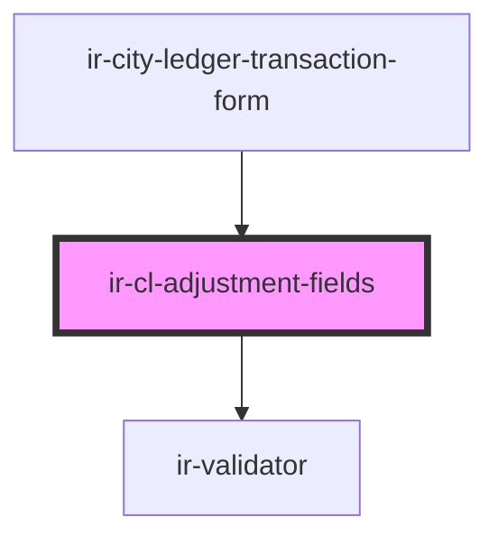

# ir-cl-adjustment-fields

<!-- Auto Generated Below -->

## Properties

| Property               | Attribute    | Description | Type                               | Default     |
| ---------------------- | ------------ | ----------- | ---------------------------------- | ----------- |
| `bookingOptions`       | --           |             | `LinkedOption[]`                   | `[]`        |
| `entryType`            | `entry-type` |             | `"" \| "CR" \| "DB"`               | `''`        |
| `linkType`             | `link-type`  |             | `"BOOKING" \| "INVOICE" \| "NONE"` | `'NONE'`    |
| `linkedId`             | `linked-id`  |             | `string`                           | `undefined` |
| `unpaidInvoiceOptions` | --           |             | `LinkedOption[]`                   | `[]`        |

## Events

| Event         | Description | Type                                          |
| ------------- | ----------- | --------------------------------------------- |
| `fieldChange` |             | `CustomEvent<CityLedgerTransactionFormDraft>` |

## Dependencies

### Used by

 - [ir-city-ledger-transaction-form](../..)

### Depends on

- [ir-validator](../../../../../../ui/ir-validator)

### Graph

----------------------------------------------

*Built with [StencilJS](https://stenciljs.com/)*
