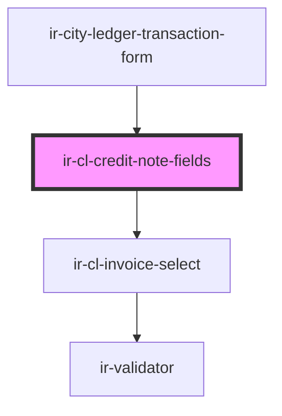

# ir-cl-credit-note-fields

<!-- Auto Generated Below -->

## Properties

| Property               | Attribute                 | Description | Type                                                                                                                                                                                                                                                                                                                                                                                                                                                                                                                                                                                                                                                             | Default            |
| ---------------------- | ------------------------- | ----------- | ---------------------------------------------------------------------------------------------------------------------------------------------------------------------------------------------------------------------------------------------------------------------------------------------------------------------------------------------------------------------------------------------------------------------------------------------------------------------------------------------------------------------------------------------------------------------------------------------------------------------------------------------------------------- | ------------------ |
| `creditNoteMode`       | `credit-note-mode`        |             | `"cancel-invoice" \| "goodwill"`                                                                                                                                                                                                                                                                                                                                                                                                                                                                                                                                                                                                                                 | `'cancel-invoice'` |
| `fiscalDocuments`      | --                        |             | `{ DOC_NUMBER?: string; FD_TYPE_CODE?: string; CURRENCY_ID?: number; TOTAL_AMOUNT?: number; CREDIT?: number; DEBIT?: number; NET_AMOUNT?: number; TAX_AMOUNT?: number; FROM_DATE?: string; TO_DATE?: string; BOOK_NBR?: string; AGENCY_ID?: number; AGENCY_NAME?: string; CREDIT_DISPLAY?: string; CURRENCY_CODE?: string; DEBIT_DISPLAY?: string; EXTERNAL_REF?: string; FD_ID?: number; FD_STATUS_CODE?: string; FD_STATUS_NAME?: string; FD_TYPE_NAME?: string; ISSUE_DATE?: string; ISSUE_DATE_DISPLAY?: string; IS_PRINTED?: boolean; NET_AMOUNT_DISPLAY?: string; TAX_AMOUNT_DISPLAY?: string; BALANCE_BEFORE_TX?: number; BALANCE_AFTER_TX?: number; }[]` | `[]`               |
| `invoiceId`            | `invoice-id`              |             | `string`                                                                                                                                                                                                                                                                                                                                                                                                                                                                                                                                                                                                                                                         | `undefined`        |
| `isFetchingFiscalDocs` | `is-fetching-fiscal-docs` |             | `boolean`                                                                                                                                                                                                                                                                                                                                                                                                                                                                                                                                                                                                                                                        | `false`            |

## Events

| Event         | Description | Type                                          |
| ------------- | ----------- | --------------------------------------------- |
| `fieldChange` |             | `CustomEvent<CityLedgerTransactionFormDraft>` |

## Dependencies

### Used by

 - [ir-city-ledger-transaction-form](../..)

### Depends on

- [ir-cl-invoice-select](../ir-cl-invoice-select)

### Graph

----------------------------------------------

*Built with [StencilJS](https://stenciljs.com/)*
