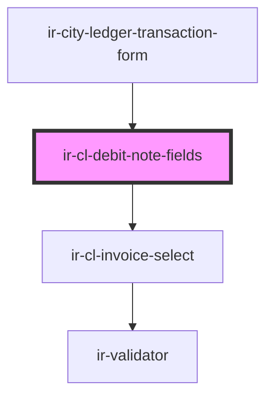

# ir-cl-debit-note-fields

<!-- Auto Generated Below -->

## Properties

| Property          | Attribute    | Description | Type                                                                                                                                                                                                                                                                                                                                                                                                                                                                                                                                                                                                                                                             | Default     |
| ----------------- | ------------ | ----------- | ---------------------------------------------------------------------------------------------------------------------------------------------------------------------------------------------------------------------------------------------------------------------------------------------------------------------------------------------------------------------------------------------------------------------------------------------------------------------------------------------------------------------------------------------------------------------------------------------------------------------------------------------------------------- | ----------- |
| `fiscalDocuments` | --           |             | `{ FROM_DATE?: string; TO_DATE?: string; BOOK_NBR?: string; AGENCY_ID?: number; CURRENCY_ID?: number; AGENCY_NAME?: string; CREDIT?: number; CREDIT_DISPLAY?: string; CURRENCY_CODE?: string; DEBIT?: number; DEBIT_DISPLAY?: string; DOC_NUMBER?: string; EXTERNAL_REF?: string; FD_ID?: number; FD_STATUS_CODE?: string; FD_STATUS_NAME?: string; FD_TYPE_CODE?: string; FD_TYPE_NAME?: string; ISSUE_DATE?: string; ISSUE_DATE_DISPLAY?: string; IS_PRINTED?: boolean; NET_AMOUNT?: number; NET_AMOUNT_DISPLAY?: string; TAX_AMOUNT?: number; TAX_AMOUNT_DISPLAY?: string; TOTAL_AMOUNT?: number; BALANCE_BEFORE_TX?: number; BALANCE_AFTER_TX?: number; }[]` | `[]`        |
| `invoiceId`       | `invoice-id` |             | `string`                                                                                                                                                                                                                                                                                                                                                                                                                                                                                                                                                                                                                                                         | `undefined` |

## Events

| Event         | Description | Type                                                                                                                                                                                                                                                                                                                                                                                                                                                                                                                                                                                                                                                  |
| ------------- | ----------- | ----------------------------------------------------------------------------------------------------------------------------------------------------------------------------------------------------------------------------------------------------------------------------------------------------------------------------------------------------------------------------------------------------------------------------------------------------------------------------------------------------------------------------------------------------------------------------------------------------------------------------------------------------- |
| `fieldChange` |             | `CustomEvent<{ transactionType?: TransactionType; date?: string; amount?: string; taxId?: string; reference?: string; notes?: string; entryType?: "" \| "DB" \| "CR"; isCutover?: boolean; payment_type?: PaymentTypeOption; payment_method?: PaymentMethodOption; designation?: string; invoiceId?: string; onAccount?: boolean; serviceCategoryId?: string; linkType?: "NONE" \| "INVOICE" \| "BOOKING"; linkedId?: string; reason?: "" \| "ROUNDING_DIFFERENCE" \| "GOODWILL_CREDIT" \| "PRICE_MATCH" \| "COMMISSION_CORRECTION" \| "DISCOUNT_CORRECTION"; generatesFiscalDocument?: boolean; creditNoteMode?: "cancel-invoice" \| "goodwill"; }>` |

## Dependencies

### Used by

 - [ir-city-ledger-transaction-form](../..)

### Depends on

- [ir-cl-invoice-select](../ir-cl-invoice-select)

### Graph

----------------------------------------------

*Built with [StencilJS](https://stenciljs.com/)*
