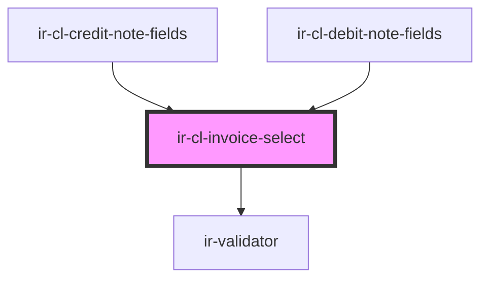

# ir-cl-invoice-select

<!-- Auto Generated Below -->

## Properties

| Property          | Attribute | Description | Type                                                                                                                                                                                                                                                                                                                                                                                                                                                                                                                                                                                                                                                             | Default     |
| ----------------- | --------- | ----------- | ---------------------------------------------------------------------------------------------------------------------------------------------------------------------------------------------------------------------------------------------------------------------------------------------------------------------------------------------------------------------------------------------------------------------------------------------------------------------------------------------------------------------------------------------------------------------------------------------------------------------------------------------------------------- | ----------- |
| `fiscalDocuments` | --        |             | `{ FROM_DATE?: string; TO_DATE?: string; BOOK_NBR?: string; AGENCY_ID?: number; CURRENCY_ID?: number; AGENCY_NAME?: string; CREDIT?: number; CREDIT_DISPLAY?: string; CURRENCY_CODE?: string; DEBIT?: number; DEBIT_DISPLAY?: string; DOC_NUMBER?: string; EXTERNAL_REF?: string; FD_ID?: number; FD_STATUS_CODE?: string; FD_STATUS_NAME?: string; FD_TYPE_CODE?: string; FD_TYPE_NAME?: string; ISSUE_DATE?: string; ISSUE_DATE_DISPLAY?: string; IS_PRINTED?: boolean; NET_AMOUNT?: number; NET_AMOUNT_DISPLAY?: string; TAX_AMOUNT?: number; TAX_AMOUNT_DISPLAY?: string; TOTAL_AMOUNT?: number; BALANCE_BEFORE_TX?: number; BALANCE_AFTER_TX?: number; }[]` | `[]`        |
| `hint`            | `hint`    |             | `string`                                                                                                                                                                                                                                                                                                                                                                                                                                                                                                                                                                                                                                                         | `''`        |
| `label`           | `label`   |             | `string`                                                                                                                                                                                                                                                                                                                                                                                                                                                                                                                                                                                                                                                         | `'Invoice'` |
| `value`           | `value`   |             | `string`                                                                                                                                                                                                                                                                                                                                                                                                                                                                                                                                                                                                                                                         | `''`        |

## Events

| Event           | Description | Type                  |
| --------------- | ----------- | --------------------- |
| `invoiceChange` |             | `CustomEvent<string>` |

## Dependencies

### Used by

 - [ir-cl-credit-note-fields](../ir-cl-credit-note-fields)
 - [ir-cl-debit-note-fields](../ir-cl-debit-note-fields)

### Depends on

- [ir-validator](../../../../../../ui/ir-validator)

### Graph

----------------------------------------------

*Built with [StencilJS](https://stenciljs.com/)*
