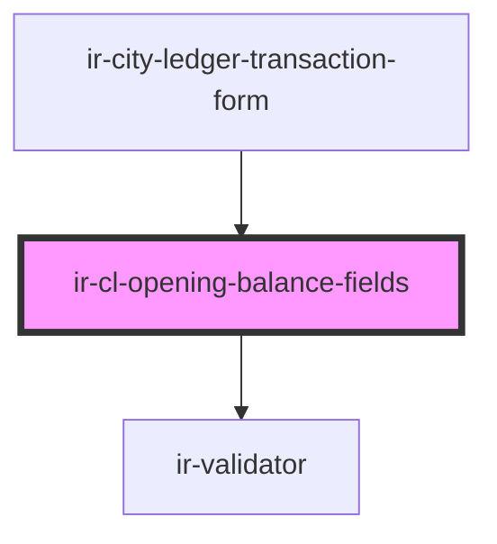

# ir-cl-opening-balance-fields

<!-- Auto Generated Below -->

## Properties

| Property    | Attribute    | Description | Type                 | Default |
| ----------- | ------------ | ----------- | -------------------- | ------- |
| `entryType` | `entry-type` |             | `"" \| "CR" \| "DB"` | `''`    |

## Events

| Event         | Description | Type                                          |
| ------------- | ----------- | --------------------------------------------- |
| `fieldChange` |             | `CustomEvent<CityLedgerTransactionFormDraft>` |

## Dependencies

### Used by

 - [ir-city-ledger-transaction-form](../..)

### Depends on

- [ir-validator](../../../../../../ui/ir-validator)

### Graph

----------------------------------------------

*Built with [StencilJS](https://stenciljs.com/)*
