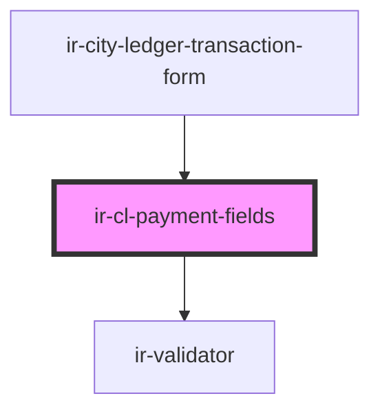

# ir-cl-payment-fields

<!-- Auto Generated Below -->

## Properties

| Property               | Attribute             | Description | Type             | Default     |
| ---------------------- | --------------------- | ----------- | ---------------- | ----------- |
| `invoiceId`            | `invoice-id`          |             | `string`         | `undefined` |
| `isOnAccount`          | `is-on-account`       |             | `boolean`        | `false`     |
| `language`             | `language`            |             | `string`         | `'en'`      |
| `noInvoices`           | `no-invoices`         |             | `boolean`        | `false`     |
| `paymentMethodCode`    | `payment-method-code` |             | `string`         | `''`        |
| `paymentMethods`       | --                    |             | `IEntries[]`     | `[]`        |
| `unpaidInvoiceOptions` | --                    |             | `LinkedOption[]` | `[]`        |

## Events

| Event         | Description | Type                                          |
| ------------- | ----------- | --------------------------------------------- |
| `fieldChange` |             | `CustomEvent<CityLedgerTransactionFormDraft>` |

## Dependencies

### Used by

 - [ir-city-ledger-transaction-form](../..)

### Depends on

- [ir-validator](../../../../../../ui/ir-validator)

### Graph

----------------------------------------------

*Built with [StencilJS](https://stenciljs.com/)*
