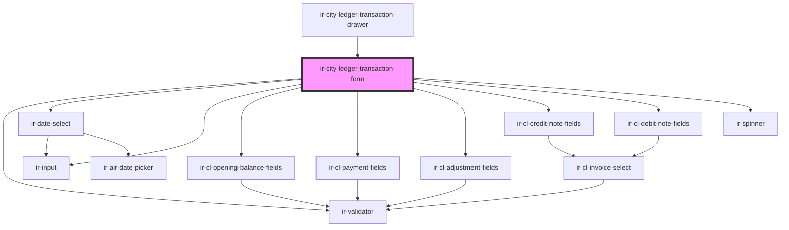

# ir-city-ledger-transaction-form

<!-- Auto Generated Below -->

## Properties

| Property                 | Attribute                  | Description | Type                                                                                                                                                                                                                                                                                                                                                                                                                                                                                                                                                                                                                                                                                                                                                                                                                                                                                                                                                                                                                                                                                                                                                                                                                                                                                                                                                                                                                                                                                                                                                                                                                                                                                                                                                                                    | Default                          |
| ------------------------ | -------------------------- | ----------- | --------------------------------------------------------------------------------------------------------------------------------------------------------------------------------------------------------------------------------------------------------------------------------------------------------------------------------------------------------------------------------------------------------------------------------------------------------------------------------------------------------------------------------------------------------------------------------------------------------------------------------------------------------------------------------------------------------------------------------------------------------------------------------------------------------------------------------------------------------------------------------------------------------------------------------------------------------------------------------------------------------------------------------------------------------------------------------------------------------------------------------------------------------------------------------------------------------------------------------------------------------------------------------------------------------------------------------------------------------------------------------------------------------------------------------------------------------------------------------------------------------------------------------------------------------------------------------------------------------------------------------------------------------------------------------------------------------------------------------------------------------------------------------------- | -------------------------------- |
| `agent`                  | --                         |             | `{ name?: string; id?: number; email?: string; property_id?: any; code?: string; address?: string; agent_rate_type_code?: { code?: string; description?: string; }; agent_type_code?: { code?: string; description?: string; }; city?: string; contact_name?: string; contract_nbr?: any; country_id?: number; currency_id?: any; due_balance?: any; email_copied_upon_booking?: string; is_active?: boolean; is_send_guest_confirmation_email?: boolean; notes?: string; payment_mode?: { code?: string; description?: string; }; phone?: string; provided_discount?: any; question?: string; sort_order?: any; tax_nbr?: string; reference?: string; verification_mode?: string; has_opening_balance?: boolean; cl_post_timing?: { code?: string; description?: string; }; }`                                                                                                                                                                                                                                                                                                                                                                                                                                                                                                                                                                                                                                                                                                                                                                                                                                                                                                                                                                                                         | `null`                           |
| `booking`                | --                         |             | `Booking`                                                                                                                                                                                                                                                                                                                                                                                                                                                                                                                                                                                                                                                                                                                                                                                                                                                                                                                                                                                                                                                                                                                                                                                                                                                                                                                                                                                                                                                                                                                                                                                                                                                                                                                                                                               | `null`                           |
| `bookingOptions`         | --                         |             | `LinkedOption[]`                                                                                                                                                                                                                                                                                                                                                                                                                                                                                                                                                                                                                                                                                                                                                                                                                                                                                                                                                                                                                                                                                                                                                                                                                                                                                                                                                                                                                                                                                                                                                                                                                                                                                                                                                                        | `[]`                             |
| `formId`                 | `form-id`                  |             | `string`                                                                                                                                                                                                                                                                                                                                                                                                                                                                                                                                                                                                                                                                                                                                                                                                                                                                                                                                                                                                                                                                                                                                                                                                                                                                                                                                                                                                                                                                                                                                                                                                                                                                                                                                                                                | `'city-ledger-transaction-form'` |
| `initialTransactionType` | `initial-transaction-type` |             | `"ADJ" \| "ADJC" \| "CN" \| "CPN" \| "DB" \| "DN" \| "DSC" \| "OB" \| "PAY"`                                                                                                                                                                                                                                                                                                                                                                                                                                                                                                                                                                                                                                                                                                                                                                                                                                                                                                                                                                                                                                                                                                                                                                                                                                                                                                                                                                                                                                                                                                                                                                                                                                                                                                            | `'PAY'`                          |
| `language`               | `language`                 |             | `string`                                                                                                                                                                                                                                                                                                                                                                                                                                                                                                                                                                                                                                                                                                                                                                                                                                                                                                                                                                                                                                                                                                                                                                                                                                                                                                                                                                                                                                                                                                                                                                                                                                                                                                                                                                                | `'en'`                           |
| `serviceCategoryOptions` | --                         |             | `ServiceCategoryOption[]`                                                                                                                                                                                                                                                                                                                                                                                                                                                                                                                                                                                                                                                                                                                                                                                                                                                                                                                                                                                                                                                                                                                                                                                                                                                                                                                                                                                                                                                                                                                                                                                                                                                                                                                                                               | `[]`                             |
| `transaction`            | --                         |             | `{ PR_ID?: number; ENTRY_DATE?: string; ENTRY_USER_ID?: number; OWNER_ID?: number; FROM_DATE?: string; TO_DATE?: string; BOOK_NBR?: string; CURRENCY_ID?: number; CREDIT?: number; DEBIT?: number; DOC_NUMBER?: string; EXTERNAL_REF?: string; FD_ID?: number; NET_AMOUNT?: number; TAX_AMOUNT?: number; TOTAL_AMOUNT?: number; BH_ID?: number; BSA_REF?: string; CATEGORY?: string; AGENT_BOOKING_NBR?: string; ADULTS_NBR?: number; CHILD_NBR?: number; INFANT_NBR?: number; GUEST_FIRST_NAME?: string; GUEST_LAST_NAME?: string; ROOM_CATEGORY_ID?: number; ROOM_TYPE_ID?: number; RATE_PLAN_ID?: number; SERVICE_DATE?: string; CITY_TAX_AMOUNT?: number; CITY_TAX_PERCENT?: number; CL_TX_ID?: number; CL_TX_TYPE_CODE?: string; DESCRIPTION?: string; IS_HOLD?: boolean; IS_LOCKED?: boolean; My_Bh?: any; My_Currency?: any; My_Fd?: { FROM_DATE?: string; TO_DATE?: string; BOOK_NBR?: string; AGENCY_ID?: number; CURRENCY_ID?: number; AGENCY_NAME?: string; CREDIT?: number; CREDIT_DISPLAY?: string; CURRENCY_CODE?: string; DEBIT?: number; DEBIT_DISPLAY?: string; DOC_NUMBER?: string; EXTERNAL_REF?: string; FD_ID?: number; FD_STATUS_CODE?: string; FD_STATUS_NAME?: string; FD_TYPE_CODE?: string; FD_TYPE_NAME?: string; ISSUE_DATE?: string; ISSUE_DATE_DISPLAY?: string; IS_PRINTED?: boolean; NET_AMOUNT?: number; NET_AMOUNT_DISPLAY?: string; TAX_AMOUNT?: number; TAX_AMOUNT_DISPLAY?: string; TOTAL_AMOUNT?: number; BALANCE_BEFORE_TX?: number; BALANCE_AFTER_TX?: number; }; My_Pr?: any; My_Room_category?: any; RUNNING_BALANCE?: number; My_Room_type?: any; My_Travel_agency?: null; PAY_METHOD_CODE?: string; REL_ENTITY?: "TBL_BSAD" \| "TBL_BSP"; REL_ENTITY_KEY?: number; TRAVEL_AGENCY_ID?: number; VAT_AMOUNT?: number; VAT_PERCENT?: number; }` | `null`                           |
| `unpaidInvoiceOptions`   | --                         |             | `LinkedOption[]`                                                                                                                                                                                                                                                                                                                                                                                                                                                                                                                                                                                                                                                                                                                                                                                                                                                                                                                                                                                                                                                                                                                                                                                                                                                                                                                                                                                                                                                                                                                                                                                                                                                                                                                                                                        | `[]`                             |

## Events

| Event                         | Description | Type                                          |
| ----------------------------- | ----------- | --------------------------------------------- |
| `clFiscalDocumentPreview`     |             | `CustomEvent<ClFiscalDocumentPreviewRequest>` |
| `submitDisabledChange`        |             | `CustomEvent<boolean>`                        |
| `transactionSaved`            |             | `CustomEvent<void>`                           |
| `transactionValidationFailed` |             | `CustomEvent<ZodIssue[]>`                     |

## Dependencies

### Used by

 - [ir-city-ledger-transaction-drawer](..)

### Depends on

- [ir-validator](../../../../ui/ir-validator)
- [ir-date-select](../../../../ui/date-picker/ir-date-select)
- [ir-input](../../../../ui/ir-input)
- [ir-cl-opening-balance-fields](./fields/ir-cl-opening-balance-fields)
- [ir-cl-payment-fields](./fields/ir-cl-payment-fields)
- [ir-cl-adjustment-fields](./fields/ir-cl-adjustment-fields)
- [ir-cl-credit-note-fields](./fields/ir-cl-credit-note-fields)
- [ir-cl-debit-note-fields](./fields/ir-cl-debit-note-fields)
- [ir-spinner](../../../../ui/ir-spinner)

### Graph

----------------------------------------------

*Built with [StencilJS](https://stenciljs.com/)*
