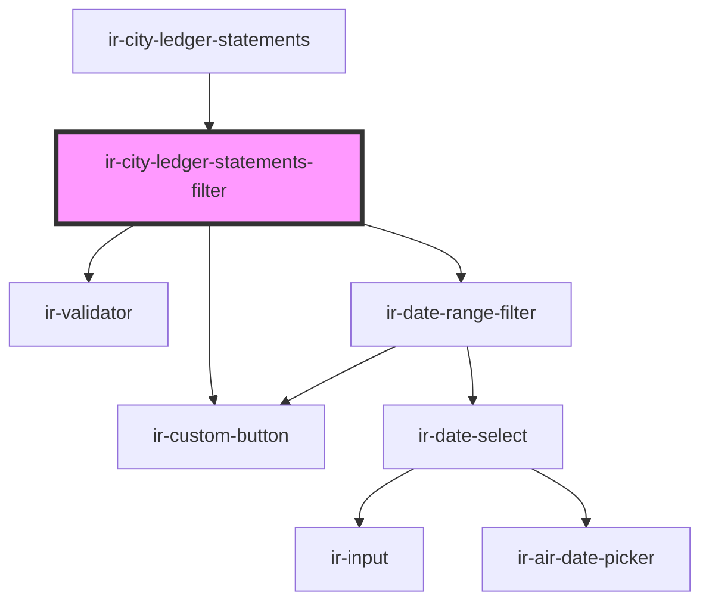

# ir-city-ledger-statements-filter

<!-- Auto Generated Below -->

## Properties

| Property          | Attribute           | Description | Type     | Default |
| ----------------- | ------------------- | ----------- | -------- | ------- |
| `initialFromDate` | `initial-from-date` |             | `string` | `null`  |
| `initialToDate`   | `initial-to-date`   |             | `string` | `null`  |

## Events

| Event             | Description | Type                            |
| ----------------- | ----------- | ------------------------------- |
| `createStatement` |             | `CustomEvent<StatementFilters>` |
| `filtersChange`   |             | `CustomEvent<StatementFilters>` |
| `printStatement`  |             | `CustomEvent<StatementFilters>` |

## Dependencies

### Used by

 - [ir-city-ledger-statements](..)

### Depends on

- [ir-validator](../../../ui/ir-validator)
- [ir-date-range-filter](../../../ui/ir-date-range-filter)
- [ir-custom-button](../../../ui/ir-custom-button)

### Graph

----------------------------------------------

*Built with [StencilJS](https://stenciljs.com/)*
