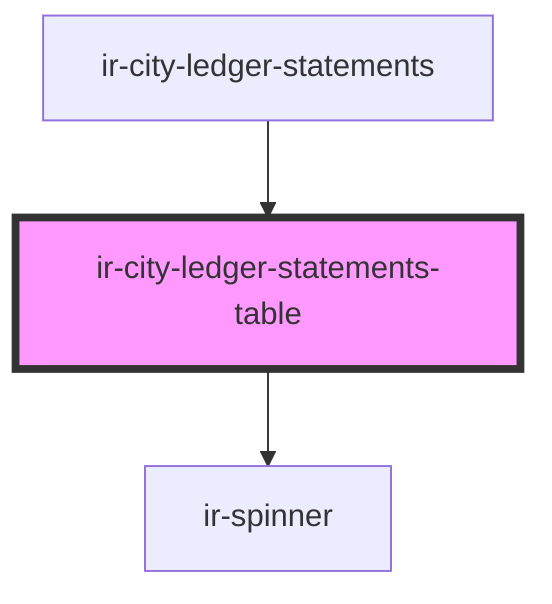

# ir-city-ledger-statements-table

<!-- Auto Generated Below -->

## Properties

| Property          | Attribute          | Description | Type                                                                                                                                                                                                                                                                                                                                                                                                                                                                                                                                                                                                                                                             | Default     |
| ----------------- | ------------------ | ----------- | ---------------------------------------------------------------------------------------------------------------------------------------------------------------------------------------------------------------------------------------------------------------------------------------------------------------------------------------------------------------------------------------------------------------------------------------------------------------------------------------------------------------------------------------------------------------------------------------------------------------------------------------------------------------- | ----------- |
| `agentId`         | `agent-id`         |             | `number`                                                                                                                                                                                                                                                                                                                                                                                                                                                                                                                                                                                                                                                         | `undefined` |
| `currencies`      | --                 |             | `ICurrency[]`                                                                                                                                                                                                                                                                                                                                                                                                                                                                                                                                                                                                                                                    | `[]`        |
| `currencySymbol`  | `currency-symbol`  |             | `string`                                                                                                                                                                                                                                                                                                                                                                                                                                                                                                                                                                                                                                                         | `'$'`       |
| `endingBalance`   | `ending-balance`   |             | `number`                                                                                                                                                                                                                                                                                                                                                                                                                                                                                                                                                                                                                                                         | `0`         |
| `fromDate`        | `from-date`        |             | `string`                                                                                                                                                                                                                                                                                                                                                                                                                                                                                                                                                                                                                                                         | `null`      |
| `hasFetched`      | `has-fetched`      |             | `boolean`                                                                                                                                                                                                                                                                                                                                                                                                                                                                                                                                                                                                                                                        | `false`     |
| `isLoading`       | `is-loading`       |             | `boolean`                                                                                                                                                                                                                                                                                                                                                                                                                                                                                                                                                                                                                                                        | `false`     |
| `rows`            | --                 |             | `{ DOC_NUMBER?: string; FD_TYPE_CODE?: string; CURRENCY_ID?: number; TOTAL_AMOUNT?: number; CREDIT?: number; DEBIT?: number; NET_AMOUNT?: number; TAX_AMOUNT?: number; FROM_DATE?: string; TO_DATE?: string; BOOK_NBR?: string; AGENCY_ID?: number; AGENCY_NAME?: string; CREDIT_DISPLAY?: string; CURRENCY_CODE?: string; DEBIT_DISPLAY?: string; EXTERNAL_REF?: string; FD_ID?: number; FD_STATUS_CODE?: string; FD_STATUS_NAME?: string; FD_TYPE_NAME?: string; ISSUE_DATE?: string; ISSUE_DATE_DISPLAY?: string; IS_PRINTED?: boolean; NET_AMOUNT_DISPLAY?: string; TAX_AMOUNT_DISPLAY?: string; BALANCE_BEFORE_TX?: number; BALANCE_AFTER_TX?: number; }[]` | `[]`        |
| `startingBalance` | `starting-balance` |             | `number`                                                                                                                                                                                                                                                                                                                                                                                                                                                                                                                                                                                                                                                         | `0`         |
| `toDate`          | `to-date`          |             | `string`                                                                                                                                                                                                                                                                                                                                                                                                                                                                                                                                                                                                                                                         | `null`      |

## Events

| Event                     | Description | Type                                          |
| ------------------------- | ----------- | --------------------------------------------- |
| `clFiscalDocumentPreview` |             | `CustomEvent<ClFiscalDocumentPreviewRequest>` |

## Dependencies

### Used by

 - [ir-city-ledger-statements](..)

### Depends on

- [ir-spinner](../../../ui/ir-spinner)

### Graph

----------------------------------------------

*Built with [StencilJS](https://stenciljs.com/)*
