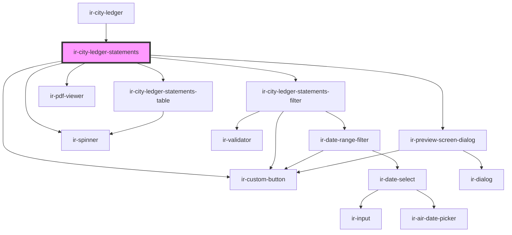

# ir-city-ledger-statements

<!-- Auto Generated Below -->

## Properties

| Property         | Attribute         | Description | Type               | Default     |
| ---------------- | ----------------- | ----------- | ------------------ | ----------- |
| `agentId`        | `agent-id`        |             | `number`           | `null`      |
| `agentName`      | `agent-name`      |             | `string`           | `''`        |
| `currencies`     | --                |             | `ICurrency[]`      | `[]`        |
| `currencySymbol` | `currency-symbol` |             | `string`           | `'$'`       |
| `initialFilters` | --                |             | `StatementFilters` | `undefined` |
| `propertyId`     | `property-id`     |             | `number`           | `undefined` |
| `ticket`         | `ticket`          |             | `string`           | `undefined` |

## Events

| Event                 | Description | Type                            |
| --------------------- | ----------- | ------------------------------- |
| `clStmtFiltersChange` |             | `CustomEvent<StatementFilters>` |

## Dependencies

### Used by

 - [ir-city-ledger](..)

### Depends on

- [ir-city-ledger-statements-filter](ir-city-ledger-statements-filter)
- [ir-city-ledger-statements-table](ir-city-ledger-statements-table)
- [ir-preview-screen-dialog](../../ir-preview-screen-dialog)
- [ir-custom-button](../../ui/ir-custom-button)
- [ir-spinner](../../ui/ir-spinner)
- [ir-pdf-viewer](../../ir-pdf-viewer)

### Graph

----------------------------------------------

*Built with [StencilJS](https://stenciljs.com/)*
