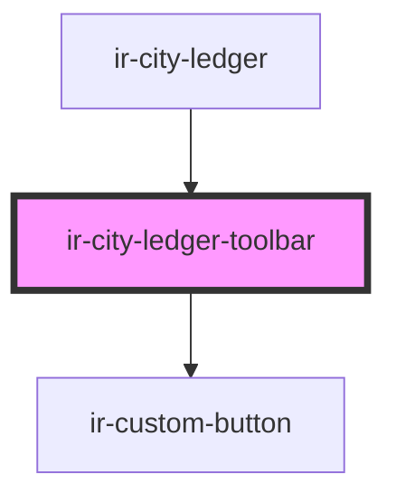

# ir-city-ledger-toolbar

<!-- Auto Generated Below -->

## Properties

| Property         | Attribute         | Description | Type     | Default |
| ---------------- | ----------------- | ----------- | -------- | ------- |
| `agentId`        | `agent-id`        |             | `number` | `null`  |
| `currencySymbol` | `currency-symbol` |             | `string` | `'$'`   |

## Events

| Event           | Description | Type                |
| --------------- | ----------- | ------------------- |
| `createInvoice` |             | `CustomEvent<void>` |

## Methods

### `refresh() => Promise<void>`

#### Returns

Type: `Promise<void>`

## Dependencies

### Used by

 - [ir-city-ledger](..)

### Depends on

- [ir-custom-button](../../ui/ir-custom-button)

### Graph

----------------------------------------------

*Built with [StencilJS](https://stenciljs.com/)*
