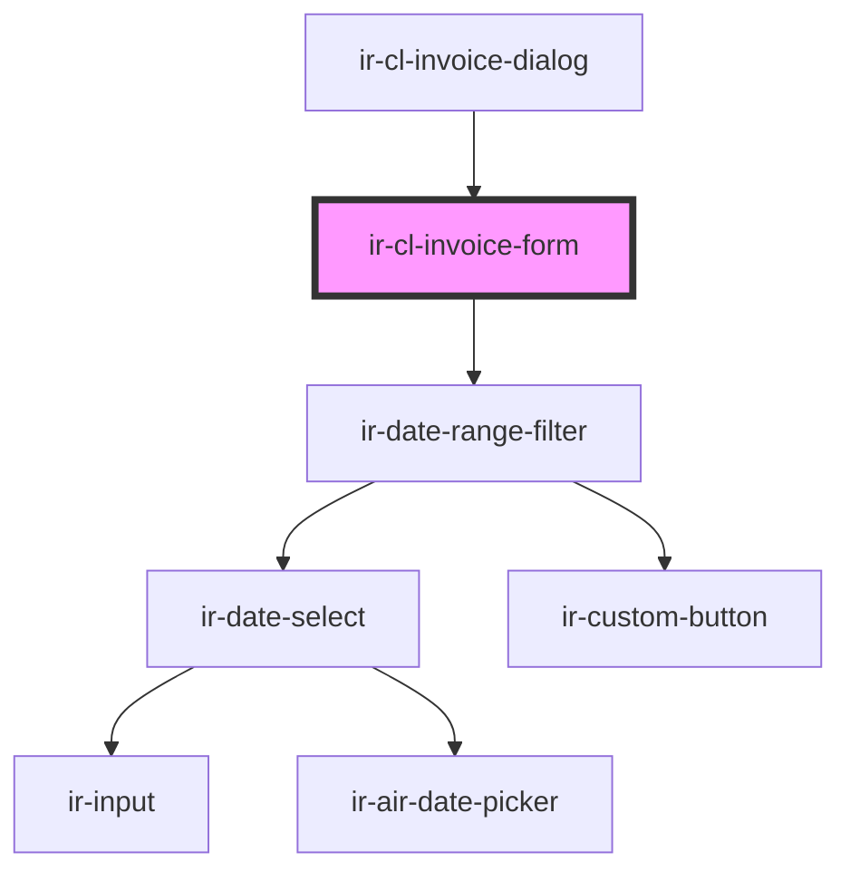

# ir-cl-invoice-form

<!-- Auto Generated Below -->

## Methods

### `getValues() => Promise<CreateInvoiceFormValues>`

#### Returns

Type: `Promise<CreateInvoiceFormValues>`

### `validate() => Promise<boolean>`

#### Returns

Type: `Promise<boolean>`

## Dependencies

### Used by

 - [ir-cl-invoice-dialog](..)

### Depends on

- [ir-date-range-filter](../../../ui/ir-date-range-filter)

### Graph

----------------------------------------------

*Built with [StencilJS](https://stenciljs.com/)*
