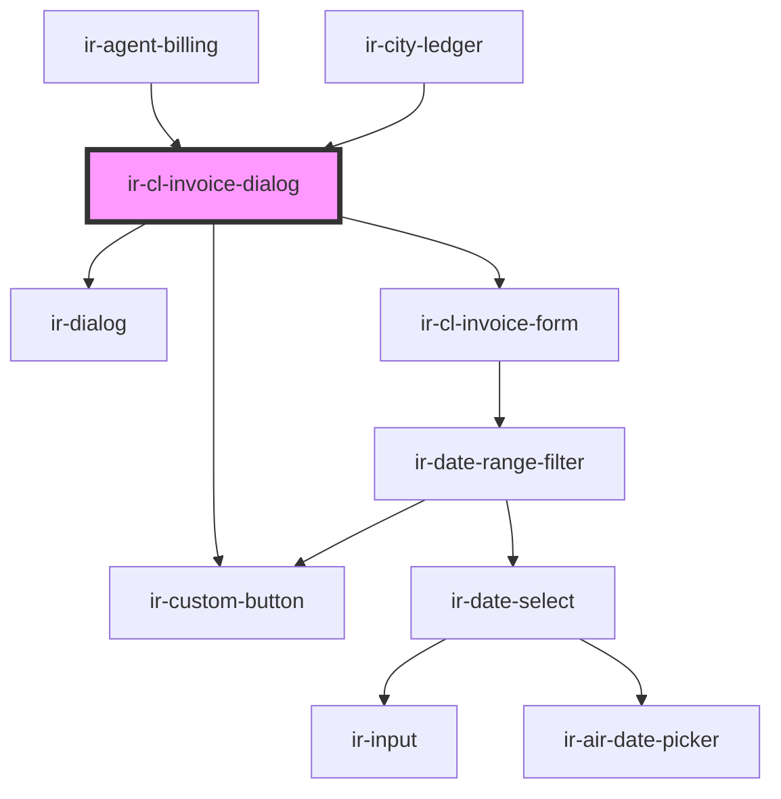

# ir-cl-invoice-dialog

<!-- Auto Generated Below -->

## Properties

| Property     | Attribute     | Description | Type                     | Default     |
| ------------ | ------------- | ----------- | ------------------------ | ----------- |
| `agentId`    | `agent-id`    |             | `number`                 | `null`      |
| `bookingNbr` | `booking-nbr` |             | `string`                 | `null`      |
| `currencyId` | `currency-id` |             | `number`                 | `null`      |
| `endDate`    | `end-date`    |             | `string`                 | `null`      |
| `mode`       | `mode`        |             | `"booking" \| "default"` | `'default'` |
| `rooms`      | --            |             | `Room[]`                 | `[]`        |
| `startDate`  | `start-date`  |             | `string`                 | `null`      |

## Events

| Event                     | Description | Type                                                                                                                                                                                                                                                                                                                                                                                                                                                                                                                                                                                                                                                                        |
| ------------------------- | ----------- | --------------------------------------------------------------------------------------------------------------------------------------------------------------------------------------------------------------------------------------------------------------------------------------------------------------------------------------------------------------------------------------------------------------------------------------------------------------------------------------------------------------------------------------------------------------------------------------------------------------------------------------------------------------------------- |
| `clFiscalDocumentPreview` |             | `CustomEvent<ClFiscalDocumentPreviewRequest>`                                                                                                                                                                                                                                                                                                                                                                                                                                                                                                                                                                                                                               |
| `invoiceIssued`           |             | `CustomEvent<{ FROM_DATE?: string; TO_DATE?: string; BOOK_NBR?: string; AGENCY_ID?: number; CURRENCY_ID?: number; AGENCY_NAME?: string; CREDIT?: number; CREDIT_DISPLAY?: string; CURRENCY_CODE?: string; DEBIT?: number; DEBIT_DISPLAY?: string; DOC_NUMBER?: string; EXTERNAL_REF?: string; FD_ID?: number; FD_STATUS_CODE?: string; FD_STATUS_NAME?: string; FD_TYPE_CODE?: string; FD_TYPE_NAME?: string; ISSUE_DATE?: string; ISSUE_DATE_DISPLAY?: string; IS_PRINTED?: boolean; NET_AMOUNT?: number; NET_AMOUNT_DISPLAY?: string; TAX_AMOUNT?: number; TAX_AMOUNT_DISPLAY?: string; TOTAL_AMOUNT?: number; BALANCE_BEFORE_TX?: number; BALANCE_AFTER_TX?: number; }>` |

## Methods

### `closeModal() => Promise<void>`

#### Returns

Type: `Promise<void>`

### `openModal() => Promise<void>`

#### Returns

Type: `Promise<void>`

## Dependencies

### Used by

 - [ir-agent-billing](../../ir-billing/ir-agent-billing)
 - [ir-city-ledger](..)

### Depends on

- [ir-dialog](../../ui/ir-dialog)
- [ir-cl-invoice-form](ir-cl-invoice-form)
- [ir-custom-button](../../ui/ir-custom-button)

### Graph

----------------------------------------------

*Built with [StencilJS](https://stenciljs.com/)*
