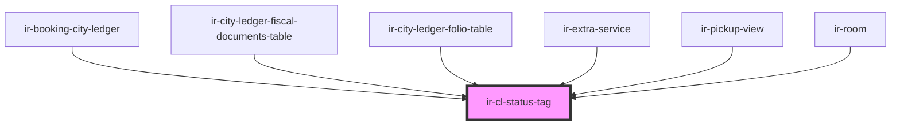

# ir-cl-status-tag

<!-- Auto Generated Below -->

## Properties

| Property                   | Attribute | Description | Type                                                                                                                                                                                                                                                                                                                                                                                                                                                                                                                                                                                                                                                                       | Default         |
| -------------------------- | --------- | ----------- | -------------------------------------------------------------------------------------------------------------------------------------------------------------------------------------------------------------------------------------------------------------------------------------------------------------------------------------------------------------------------------------------------------------------------------------------------------------------------------------------------------------------------------------------------------------------------------------------------------------------------------------------------------------------------- | --------------- |
| `size`                     | `size`    |             | `"default" \| "extra-small"`                                                                                                                                                                                                                                                                                                                                                                                                                                                                                                                                                                                                                                               | `'extra-small'` |
| `transaction` _(required)_ | --        |             | `FolioRow \| { DOC_NUMBER?: string; FD_TYPE_CODE?: string; CURRENCY_ID?: number; TOTAL_AMOUNT?: number; CREDIT?: number; DEBIT?: number; NET_AMOUNT?: number; TAX_AMOUNT?: number; FROM_DATE?: string; TO_DATE?: string; BOOK_NBR?: string; AGENCY_ID?: number; AGENCY_NAME?: string; CREDIT_DISPLAY?: string; CURRENCY_CODE?: string; DEBIT_DISPLAY?: string; EXTERNAL_REF?: string; FD_ID?: number; FD_STATUS_CODE?: string; FD_STATUS_NAME?: string; FD_TYPE_NAME?: string; ISSUE_DATE?: string; ISSUE_DATE_DISPLAY?: string; IS_PRINTED?: boolean; NET_AMOUNT_DISPLAY?: string; TAX_AMOUNT_DISPLAY?: string; BALANCE_BEFORE_TX?: number; BALANCE_AFTER_TX?: number; }` | `undefined`     |

## Dependencies

### Used by

 - [ir-booking-city-ledger](../../ir-booking-details/ir-booking-city-ledger)
 - [ir-city-ledger-fiscal-documents-table](../ir-city-ledger-fiscal-documents/ir-city-ledger-fiscal-documents-table)
 - [ir-city-ledger-folio-table](../ir-city-ledger-folio/ir-city-ledger-folio-table)
 - [ir-extra-service](../../ir-booking-details/ir-extra-services/ir-extra-service)
 - [ir-pickup-view](../../ir-booking-details/ir-pickup-view)
 - [ir-room](../../ir-booking-details/ir-room)

### Graph

----------------------------------------------

*Built with [StencilJS](https://stenciljs.com/)*
