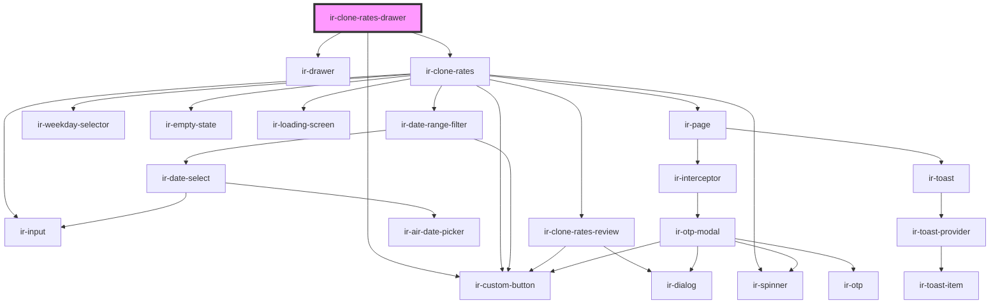

# ir-clone-rates-drawer

<!-- Auto Generated Below -->

## Properties

| Property     | Attribute    | Description | Type      | Default     |
| ------------ | ------------ | ----------- | --------- | ----------- |
| `language`   | `language`   |             | `string`  | `'en'`      |
| `open`       | `open`       |             | `boolean` | `false`     |
| `p`          | `p`          |             | `string`  | `undefined` |
| `propertyid` | `propertyid` |             | `number`  | `undefined` |
| `ticket`     | `ticket`     |             | `string`  | `undefined` |

## Events

| Event                    | Description                                                                                                                                 | Type                |
| ------------------------ | ------------------------------------------------------------------------------------------------------------------------------------------- | ------------------- |
| `cloneRatesDrawerClosed` | Fired when the drawer closes: Cancel, the close button, Escape, light dismiss, or a successful copy. The parent should set `open` to false. | `CustomEvent<void>` |

## Dependencies

### Depends on

- [ir-drawer](../../ir-drawer)
- [ir-clone-rates](..)
- [ir-custom-button](../../ui/ir-custom-button)

### Graph

----------------------------------------------

*Built with [StencilJS](https://stenciljs.com/)*
