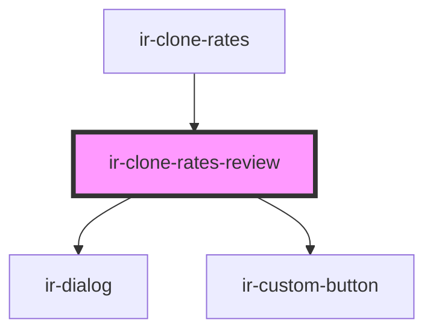

# ir-clone-rates-review

<!-- Auto Generated Below -->

## Properties

| Property  | Attribute | Description                                                                              | Type          | Default |
| --------- | --------- | ---------------------------------------------------------------------------------------- | ------------- | ------- |
| `loading` | `loading` | Shows the Confirm button as busy and blocks Go back while the copy request is in flight. | `boolean`     | `false` |
| `open`    | `open`    |                                                                                          | `boolean`     | `false` |
| `rows`    | --        | Summary lines rendered as label/value pairs.                                             | `ReviewRow[]` | `[]`    |

## Events

| Event          | Description                                                                          | Type                |
| -------------- | ------------------------------------------------------------------------------------ | ------------------- |
| `confirmClone` |                                                                                      | `CustomEvent<void>` |
| `goBack`       | Fired by Go back, the close button or Escape. The parent should set `open` to false. | `CustomEvent<void>` |

## Dependencies

### Used by

 - [ir-clone-rates](..)

### Depends on

- [ir-dialog](../../ui/ir-dialog)
- [ir-custom-button](../../ui/ir-custom-button)

### Graph

----------------------------------------------

*Built with [StencilJS](https://stenciljs.com/)*
