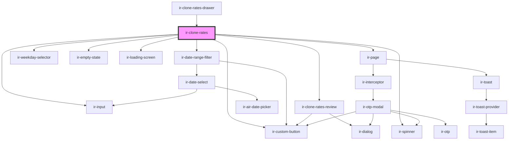

# ir-clone-rates

<!-- Auto Generated Below -->

## Properties

| Property     | Attribute    | Description                                                                                                              | Type                 | Default     |
| ------------ | ------------ | ------------------------------------------------------------------------------------------------------------------------ | -------------------- | ----------- |
| `language`   | `language`   |                                                                                                                          | `string`             | `'en'`      |
| `mode`       | `mode`       | `drawer` drops the page shell and the inline Review button; the host drawer submits `#clone-rates-form` from its footer. | `"drawer" \| "page"` | `'page'`    |
| `p`          | `p`          |                                                                                                                          | `string`             | `undefined` |
| `propertyid` | `propertyid` |                                                                                                                          | `number`             | `undefined` |
| `ticket`     | `ticket`     |                                                                                                                          | `string`             | `undefined` |

## Events

| Event         | Description                                     | Type                |
| ------------- | ----------------------------------------------- | ------------------- |
| `ratesCloned` | Fired after the rates were copied successfully. | `CustomEvent<void>` |

## Dependencies

### Used by

 - [ir-clone-rates-drawer](ir-clone-rates-drawer)

### Depends on

- [ir-date-range-filter](../ui/ir-date-range-filter)
- [ir-weekday-selector](../ui/ir-weekday-selector)
- [ir-empty-state](../ir-empty-state)
- [ir-input](../ui/ir-input)
- [ir-custom-button](../ui/ir-custom-button)
- [ir-clone-rates-review](ir-clone-rates-review)
- [ir-spinner](../ui/ir-spinner)
- [ir-loading-screen](../ir-loading-screen)
- [ir-page](../ui/ir-page)

### Graph

----------------------------------------------

*Built with [StencilJS](https://stenciljs.com/)*
