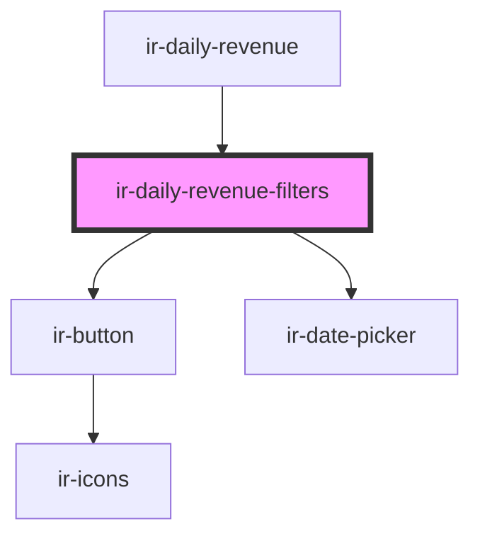

# ir-daily-revenue-filters

<!-- Auto Generated Below -->

## Properties

| Property    | Attribute    | Description | Type                          | Default     |
| ----------- | ------------ | ----------- | ----------------------------- | ----------- |
| `isLoading` | `is-loading` |             | `boolean`                     | `undefined` |
| `payments`  | --           |             | `Map<string, FolioPayment[]>` | `undefined` |

## Events

| Event             | Description | Type                                            |
| ----------------- | ----------- | ----------------------------------------------- |
| `fetchNewReports` |             | `CustomEvent<{ date: string; users: string; }>` |

## Dependencies

### Used by

 - [ir-daily-revenue](..)

### Depends on

- [ir-button](../../ui/ir-button)
- [ir-date-picker](../../ui/ir-date-picker)

### Graph

----------------------------------------------

*Built with [StencilJS](https://stenciljs.com/)*
