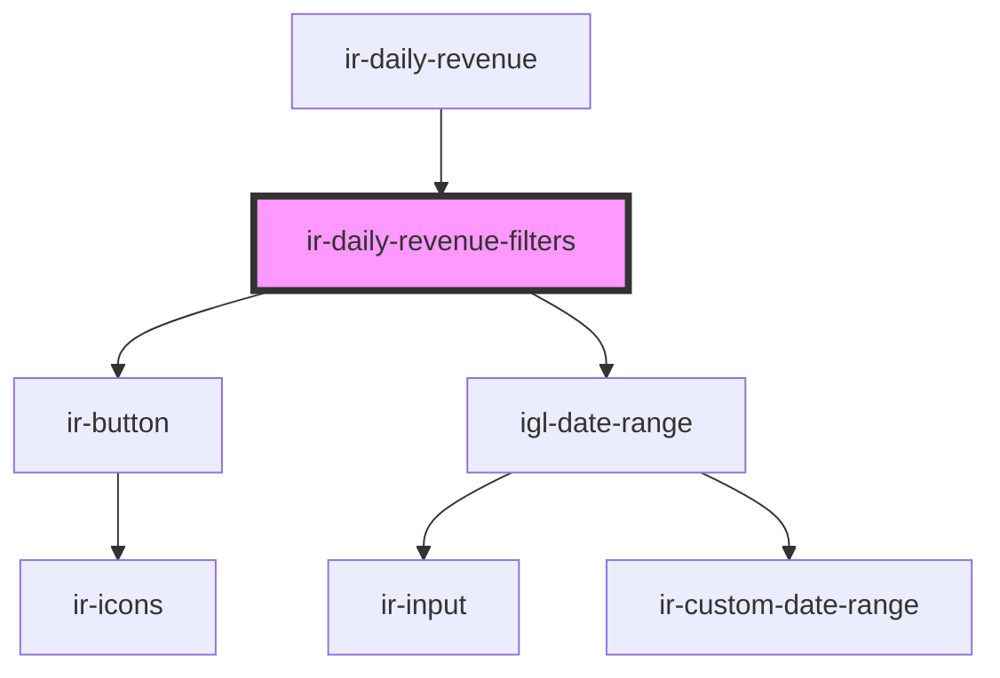

# ir-daily-revenue-filters

<!-- Auto Generated Below -->

## Properties

| Property    | Attribute    | Description | Type                          | Default     |
| ----------- | ------------ | ----------- | ----------------------------- | ----------- |
| `isLoading` | `is-loading` |             | `boolean`                     | `undefined` |
| `payments`  | --           |             | `Map<string, FolioPayment[]>` | `undefined` |

## Events

| Event             | Description | Type                                                                                   |
| ----------------- | ----------- | -------------------------------------------------------------------------------------- |
| `fetchNewReports` |             | `CustomEvent<{ from_date?: string; to_date?: string; date?: string; users: string; }>` |

## Dependencies

### Used by

 - [ir-daily-revenue](..)

### Depends on

- [ir-button](../../ui/ir-button)
- [igl-date-range](../../igloo-calendar/igl-date-range)

### Graph

```mermaid
graph TD;
  ir-daily-revenue-filters --> ir-button
  ir-daily-revenue-filters --> igl-date-range
  ir-button --> ir-icons
  igl-date-range --> ir-input
  igl-date-range --> ir-custom-date-range
  ir-daily-revenue --> ir-daily-revenue-filters
  style ir-daily-revenue-filters fill:#f9f,stroke:#333,stroke-width:4px
```

----------------------------------------------

*Built with [StencilJS](https://stenciljs.com/)*
