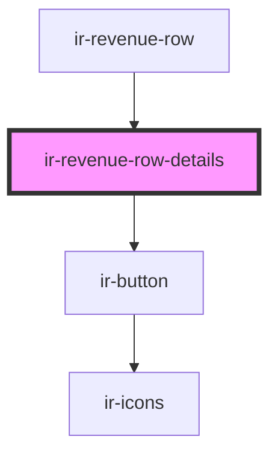

# ir-revenue-row-details

<!-- Auto Generated Below -->

## Properties

| Property  | Attribute | Description | Type           | Default     |
| --------- | --------- | ----------- | -------------- | ----------- |
| `payment` | --        |             | `FolioPayment` | `undefined` |

## Events

| Event                | Description | Type                                                                     |
| -------------------- | ----------- | ------------------------------------------------------------------------ |
| `revenueOpenSidebar` |             | `CustomEvent<{ type: "booking"; payload: { bookingNumber: number; }; }>` |

## Dependencies

### Used by

 - [ir-revenue-row](..)

### Depends on

- [ir-button](../../../../ui/ir-button)

### Graph

----------------------------------------------

*Built with [StencilJS](https://stenciljs.com/)*
