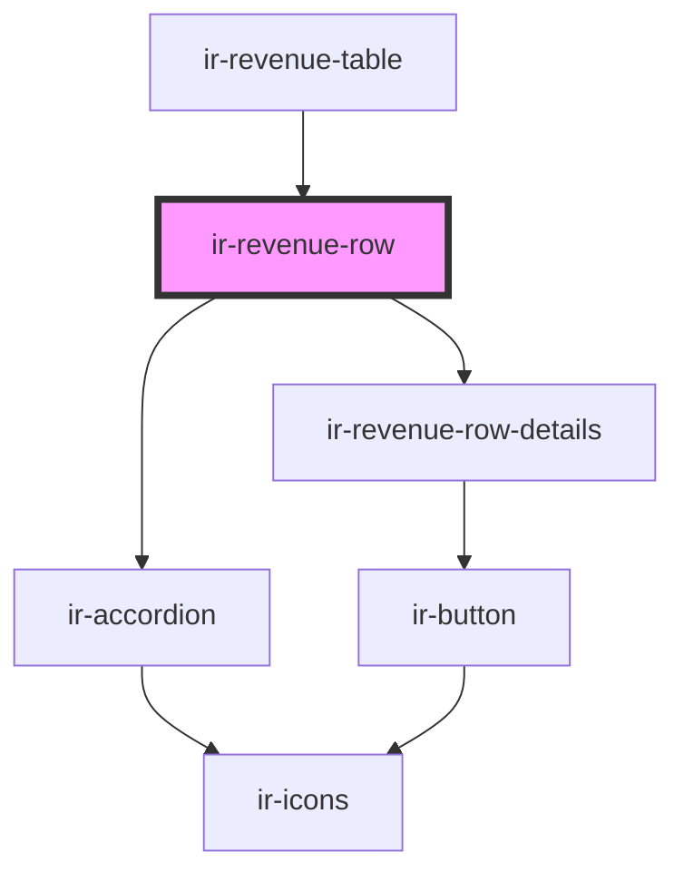

# ir-revenue-row

<!-- Auto Generated Below -->

## Properties

| Property                 | Attribute    | Description                              | Type             | Default     |
| ------------------------ | ------------ | ---------------------------------------- | ---------------- | ----------- |
| `groupName` _(required)_ | `group-name` | Group display name (e.g., "Credit Card") | `string`         | `undefined` |
| `payments`               | --           | Array of payments for this method group  | `FolioPayment[]` | `[]`        |

## Dependencies

### Used by

 - [ir-revenue-table](..)

### Depends on

- [ir-accordion](../../../ui/ir-accordion)
- [ir-revenue-row-details](ir-revenue-row-details)

### Graph

----------------------------------------------

*Built with [StencilJS](https://stenciljs.com/)*
