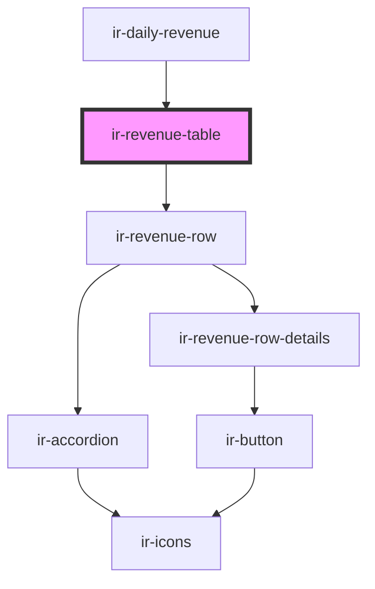

# ir-revenue-table

<!-- Auto Generated Below -->

## Properties

| Property         | Attribute | Description | Type                                                              | Default     |
| ---------------- | --------- | ----------- | ----------------------------------------------------------------- | ----------- |
| `filters`        | --        |             | `{ date: string; users: string; }`                                | `undefined` |
| `paymentEntries` | --        |             | `{ types: IEntries[]; groups: IEntries[]; methods: IEntries[]; }` | `undefined` |
| `payments`       | --        |             | `Map<string, FolioPayment[]>`                                     | `new Map()` |

## Dependencies

### Used by

 - [ir-daily-revenue](..)

### Depends on

- [ir-revenue-row](ir-revenue-row)

### Graph

----------------------------------------------

*Built with [StencilJS](https://stenciljs.com/)*
