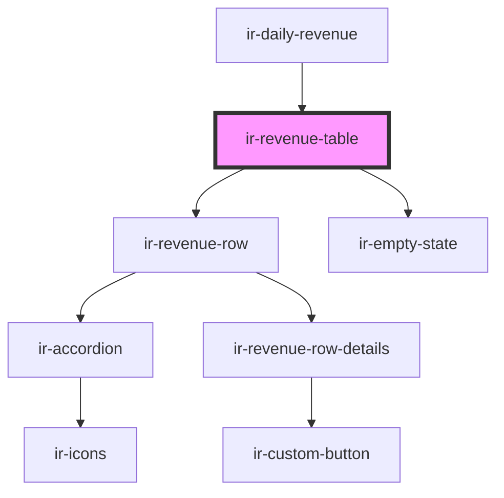

# ir-revenue-table

<!-- Auto Generated Below -->

## Properties

| Property         | Attribute | Description | Type                                                                      | Default     |
| ---------------- | --------- | ----------- | ------------------------------------------------------------------------- | ----------- |
| `filters`        | --        |             | `{ from_date?: string; to_date?: string; date?: string; users: string; }` | `undefined` |
| `paymentEntries` | --        |             | `{ types: IEntries[]; groups: IEntries[]; methods: IEntries[]; }`         | `undefined` |
| `payments`       | --        |             | `Map<string, FolioPayment[]>`                                             | `new Map()` |

## Dependencies

### Used by

 - [ir-daily-revenue](..)

### Depends on

- [ir-revenue-row](ir-revenue-row)
- [ir-empty-state](../../ir-empty-state)

### Graph

```mermaid
graph TD;
  ir-revenue-table --> ir-revenue-row
  ir-revenue-table --> ir-empty-state
  ir-revenue-row --> ir-accordion
  ir-revenue-row --> ir-revenue-row-details
  ir-accordion --> ir-icons
  ir-revenue-row-details --> ir-custom-button
  ir-daily-revenue --> ir-revenue-table
  style ir-revenue-table fill:#f9f,stroke:#333,stroke-width:4px
```

----------------------------------------------

*Built with [StencilJS](https://stenciljs.com/)*
