# ir-daily-revenue

<!-- Auto Generated Below -->

## Properties

| Property     | Attribute    | Description | Type     | Default     |
| ------------ | ------------ | ----------- | -------- | ----------- |
| `language`   | `language`   |             | `string` | `''`        |
| `p`          | `p`          |             | `string` | `undefined` |
| `propertyid` | `propertyid` |             | `number` | `undefined` |
| `ticket`     | `ticket`     |             | `string` | `''`        |

## Events

| Event             | Description | Type                |
| ----------------- | ----------- | ------------------- |
| `preventPageLoad` |             | `CustomEvent<null>` |

## Dependencies

### Used by

 - [ir-secure-tasks](../ir-secure-tasks)

### Depends on

- [ir-booking-details](../ir-booking-details)
- [ir-loading-screen](../ir-loading-screen)
- [ir-toast](../ui/ir-toast)
- [ir-interceptor](../ir-interceptor)
- [ir-button](../ui/ir-button)
- [ir-revenue-summary](ir-revenue-summary)
- [ir-daily-revenue-filters](ir-daily-revenue-filters)
- [ir-revenue-table](ir-revenue-table)
- [ir-sidebar](../ui/ir-sidebar)

### Graph

```mermaid
graph TD;
  ir-daily-revenue --> ir-booking-details
  ir-daily-revenue --> ir-loading-screen
  ir-daily-revenue --> ir-toast
  ir-daily-revenue --> ir-interceptor
  ir-daily-revenue --> ir-button
  ir-daily-revenue --> ir-revenue-summary
  ir-daily-revenue --> ir-daily-revenue-filters
  ir-daily-revenue --> ir-revenue-table
  ir-daily-revenue --> ir-sidebar
  ir-booking-details --> ir-room
  ir-booking-details --> ir-spinner
  ir-booking-details --> ir-toast
  ir-booking-details --> ir-interceptor
  ir-booking-details --> ir-booking-header
  ir-booking-details --> ir-reservation-information
  ir-booking-details --> ir-date-view
  ir-booking-details --> ir-custom-button
  ir-booking-details --> ir-pickup-view
  ir-booking-details --> ir-extra-services
  ir-booking-details --> ir-payment-details
  ir-booking-details --> ir-dialog
  ir-booking-details --> ir-room-guests
  ir-booking-details --> ir-extra-service-config
  ir-booking-details --> ir-pickup
  ir-booking-details --> ir-billing-drawer
  ir-booking-details --> ir-guest-info-drawer
  ir-booking-details --> ir-payment-folio
  ir-booking-details --> ir-booking-editor-drawer
  ir-room --> ir-custom-button
  ir-room --> ir-date-view
  ir-room --> ir-unit-tag
  ir-room --> ir-label
  ir-room --> ir-dialog
  ir-room --> ir-checkout-dialog
  ir-room --> ir-invoice
  ir-checkout-dialog --> ir-dialog
  ir-checkout-dialog --> ir-spinner
  ir-checkout-dialog --> ir-custom-button
  ir-invoice --> ir-drawer
  ir-invoice --> ir-invoice-form
  ir-invoice --> ir-custom-button
  ir-invoice --> ir-preview-screen-dialog
  ir-invoice --> ir-proforma-invoice-preview
  ir-invoice-form --> ir-spinner
  ir-invoice-form --> ir-custom-date-picker
  ir-invoice-form --> ir-booking-billing-recipient
  ir-invoice-form --> ir-empty-state
  ir-custom-date-picker --> ir-input
  ir-booking-billing-recipient --> ir-booking-company-dialog
  ir-booking-company-dialog --> ir-dialog
  ir-booking-company-dialog --> ir-booking-company-form
  ir-booking-company-dialog --> ir-custom-button
  ir-booking-company-form --> ir-input
  ir-preview-screen-dialog --> ir-dialog
  ir-preview-screen-dialog --> ir-custom-button
  ir-proforma-invoice-preview --> ir-printing-label
  ir-proforma-invoice-preview --> ir-print-room
  ir-proforma-invoice-preview --> ir-printing-pickup
  ir-proforma-invoice-preview --> ir-printing-extra-service
  ir-print-room --> ir-printing-label
  ir-printing-pickup --> ir-printing-label
  ir-printing-extra-service --> ir-printing-label
  ir-toast --> ir-toast-provider
  ir-toast-provider --> ir-toast-alert
  ir-interceptor --> ir-spinner
  ir-interceptor --> ir-otp-modal
  ir-otp-modal --> ir-spinner
  ir-otp-modal --> ir-otp
  ir-otp-modal --> ir-button
  ir-button --> ir-icons
  ir-booking-header --> ir-pms-logs
  ir-booking-header --> ir-events-log
  ir-booking-header --> ir-custom-button
  ir-booking-header --> ir-booking-status-tag
  ir-booking-header --> ir-dialog
  ir-pms-logs --> ir-spinner
  ir-pms-logs --> ir-custom-button
  ir-events-log --> ir-spinner
  ir-reservation-information --> ir-label
  ir-reservation-information --> ir-custom-button
  ir-reservation-information --> ota-label
  ir-reservation-information --> ir-booking-extra-note
  ir-reservation-information --> ir-booking-company-dialog
  ir-reservation-information --> ir-arrival-time-dialog
  ir-booking-extra-note --> ir-dialog
  ir-booking-extra-note --> ir-custom-button
  ir-arrival-time-dialog --> ir-dialog
  ir-arrival-time-dialog --> ir-custom-button
  ir-pickup-view --> ir-custom-button
  ir-pickup-view --> ir-label
  ir-pickup-view --> ir-empty-state
  ir-extra-services --> ir-custom-button
  ir-extra-services --> ir-empty-state
  ir-extra-services --> ir-extra-service
  ir-extra-service --> ir-custom-button
  ir-extra-service --> ir-date-view
  ir-extra-service --> ir-dialog
  ir-payment-details --> ir-payment-summary
  ir-payment-details --> ir-booking-guarantee
  ir-payment-details --> ir-applicable-policies
  ir-payment-details --> ir-custom-button
  ir-payment-details --> ir-payments-folio
  ir-payment-details --> ir-dialog
  ir-booking-guarantee --> ir-label
  ir-booking-guarantee --> ir-button
  ir-applicable-policies --> ir-custom-button
  ir-applicable-policies --> ir-icons
  ir-payments-folio --> ir-payment-item
  ir-payments-folio --> ir-empty-state
  ir-payments-folio --> ir-custom-button
  ir-payment-item --> ir-custom-button
  ir-room-guests --> ir-drawer
  ir-room-guests --> ir-room-guests-form
  ir-room-guests --> ir-custom-button
  ir-room-guests-form --> ir-spinner
  ir-room-guests-form --> ir-validator
  ir-room-guests-form --> ir-input
  ir-room-guests-form --> ir-country-picker
  ir-country-picker --> ir-picker
  ir-country-picker --> ir-picker-item
  ir-country-picker --> ir-input-text
  ir-extra-service-config --> ir-drawer
  ir-extra-service-config --> ir-extra-service-config-form
  ir-extra-service-config --> ir-custom-button
  ir-extra-service-config-form --> ir-validator
  ir-extra-service-config-form --> ir-custom-date-picker
  ir-extra-service-config-form --> ir-input
  ir-pickup --> ir-drawer
  ir-pickup --> ir-pickup-form
  ir-pickup --> ir-custom-button
  ir-pickup-form --> ir-validator
  ir-pickup-form --> ir-custom-date-picker
  ir-pickup-form --> ir-input
  ir-billing-drawer --> ir-drawer
  ir-billing-drawer --> ir-billing
  ir-billing --> ir-spinner
  ir-billing --> ir-custom-button
  ir-billing --> ir-empty-state
  ir-billing --> ir-invoice
  ir-billing --> ir-dialog
  ir-guest-info-drawer --> ir-drawer
  ir-guest-info-drawer --> ir-guest-info-form
  ir-guest-info-drawer --> ir-custom-button
  ir-guest-info-form --> ir-spinner
  ir-guest-info-form --> ir-validator
  ir-guest-info-form --> ir-input
  ir-guest-info-form --> ir-country-picker
  ir-guest-info-form --> ir-mobile-input
  ir-mobile-input --> ir-input
  ir-payment-folio --> ir-drawer
  ir-payment-folio --> ir-payment-folio-form
  ir-payment-folio --> ir-custom-button
  ir-payment-folio-form --> ir-custom-date-picker
  ir-payment-folio-form --> ir-validator
  ir-payment-folio-form --> ir-input
  ir-booking-editor-drawer --> ir-custom-button
  ir-booking-editor-drawer --> ir-drawer
  ir-booking-editor-drawer --> ir-booking-editor
  ir-booking-editor --> ir-spinner
  ir-booking-editor --> ir-interceptor
  ir-booking-editor --> ir-booking-editor-header
  ir-booking-editor --> igl-room-type
  ir-booking-editor --> ir-booking-editor-form
  ir-booking-editor-header --> ir-validator
  ir-booking-editor-header --> ir-picker
  ir-booking-editor-header --> ir-picker-item
  ir-booking-editor-header --> igl-date-range
  ir-booking-editor-header --> ir-custom-button
  igl-date-range --> ir-date-select
  ir-date-select --> ir-input
  ir-date-select --> ir-air-date-picker
  igl-room-type --> igl-rate-plan
  igl-rate-plan --> ir-input
  igl-rate-plan --> ir-custom-button
  ir-booking-editor-form --> ir-date-view
  ir-booking-editor-form --> igl-application-info
  ir-booking-editor-form --> ir-picker
  ir-booking-editor-form --> ir-picker-item
  ir-booking-editor-form --> ir-custom-button
  ir-booking-editor-form --> ir-booking-editor-guest-form
  igl-application-info --> ir-validator
  igl-application-info --> ir-input
  ir-booking-editor-guest-form --> ir-input
  ir-booking-editor-guest-form --> ir-validator
  ir-booking-editor-guest-form --> ir-country-picker
  ir-booking-editor-guest-form --> ir-mobile-input
  ir-revenue-summary --> ir-stats-card
  ir-stats-card --> ir-icons
  ir-daily-revenue-filters --> ir-button
  ir-daily-revenue-filters --> ir-date-picker
  ir-revenue-table --> ir-revenue-row
  ir-revenue-row --> ir-accordion
  ir-revenue-row --> ir-revenue-row-details
  ir-accordion --> ir-icons
  ir-revenue-row-details --> ir-button
  ir-sidebar --> ir-icon
  ir-secure-tasks --> ir-daily-revenue
  style ir-daily-revenue fill:#f9f,stroke:#333,stroke-width:4px
```

----------------------------------------------

*Built with [StencilJS](https://stenciljs.com/)*
