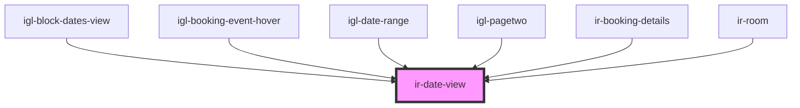

# ir-date-view

<!-- Auto Generated Below -->

## Properties

| Property             | Attribute              | Description | Type                       | Default        |
| -------------------- | ---------------------- | ----------- | -------------------------- | -------------- |
| `dateOption`         | `date-option`          |             | `string`                   | `'YYYY-MM-DD'` |
| `from_date`          | `from_date`            |             | `Date \| Moment \| string` | `undefined`    |
| `showDateDifference` | `show-date-difference` |             | `boolean`                  | `true`         |
| `to_date`            | `to_date`              |             | `Date \| Moment \| string` | `undefined`    |

## Dependencies

### Used by

 - [igl-block-dates-view](../igloo-calendar/igl-block-dates-view)
 - [igl-booking-event-hover](../igloo-calendar/igl-booking-event-hover)
 - [igl-date-range](../igloo-calendar/igl-date-range)
 - [igl-pagetwo](../igloo-calendar/igl-pagetwo)
 - [ir-booking-details](../ir-booking-details)
 - [ir-room](../ir-booking-details/ir-room)

### Graph

----------------------------------------------

*Built with [StencilJS](https://stenciljs.com/)*
