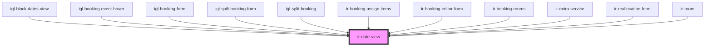

# ir-date-view

<!-- Auto Generated Below -->

## Properties

| Property             | Attribute              | Description                                                      | Type                       | Default          |
| -------------------- | ---------------------- | ---------------------------------------------------------------- | -------------------------- | ---------------- |
| `dateOption`         | `date-option`          | Input format used when `from_date` / `to_date` are plain strings | `string`                   | `'YYYY-MM-DD'`   |
| `format`             | `format`               | Display format for both dates                                    | `string`                   | `'MMM DD, YYYY'` |
| `from_date`          | `from_date`            | Raw from-date — accepts ISO string, JS Date, or Moment           | `Date \| Moment \| string` | `undefined`      |
| `showDateDifference` | `show-date-difference` | Show the night-count badge after the to-date                     | `boolean`                  | `true`           |
| `to_date`            | `to_date`              | Raw to-date — accepts ISO string, JS Date, or Moment             | `Date \| Moment \| string` | `undefined`      |

## Shadow Parts

| Part               | Description |
| ------------------ | ----------- |
| `"base"`           |             |
| `"from-date"`      |             |
| `"night-count"`    |             |
| `"separator"`      |             |
| `"separator-icon"` |             |
| `"to-date"`        |             |

## Dependencies

### Used by

 - [igl-block-dates-view](../igloo-calendar/igl-block-dates-view)
 - [igl-booking-event-hover](../igloo-calendar/igl-booking-event-hover)
 - [igl-booking-form](../igloo-calendar/igl-book-property/igl-booking-form)
 - [igl-spilt-booking-form](../igloo-calendar/igl-split-booking-drawer/igl-spilt-booking-form)
 - [igl-split-booking](../igloo-calendar/igl-split-booking)
 - [ir-booking-assign-items](../ir-booking-details/ir-booking-source-editor-dialog/ir-booking-assign-items)
 - [ir-booking-editor-form](../igloo-calendar/ir-booking-editor/ir-booking-editor-form)
 - [ir-booking-rooms](../ir-booking-details/ir-booking-rooms)
 - [ir-extra-service](../ir-booking-details/ir-extra-services/ir-extra-service)
 - [ir-reallocation-form](../ir-reallocation-drawer/ir-reallocation-form)
 - [ir-room](../ir-booking-details/ir-room)

### Graph

```mermaid
graph TD;
  igl-block-dates-view --> ir-date-view
  igl-booking-event-hover --> ir-date-view
  igl-booking-form --> ir-date-view
  igl-spilt-booking-form --> ir-date-view
  igl-split-booking --> ir-date-view
  ir-booking-assign-items --> ir-date-view
  ir-booking-editor-form --> ir-date-view
  ir-booking-rooms --> ir-date-view
  ir-extra-service --> ir-date-view
  ir-reallocation-form --> ir-date-view
  ir-room --> ir-date-view
  style ir-date-view fill:#f9f,stroke:#333,stroke-width:4px
```

----------------------------------------------

*Built with [StencilJS](https://stenciljs.com/)*
