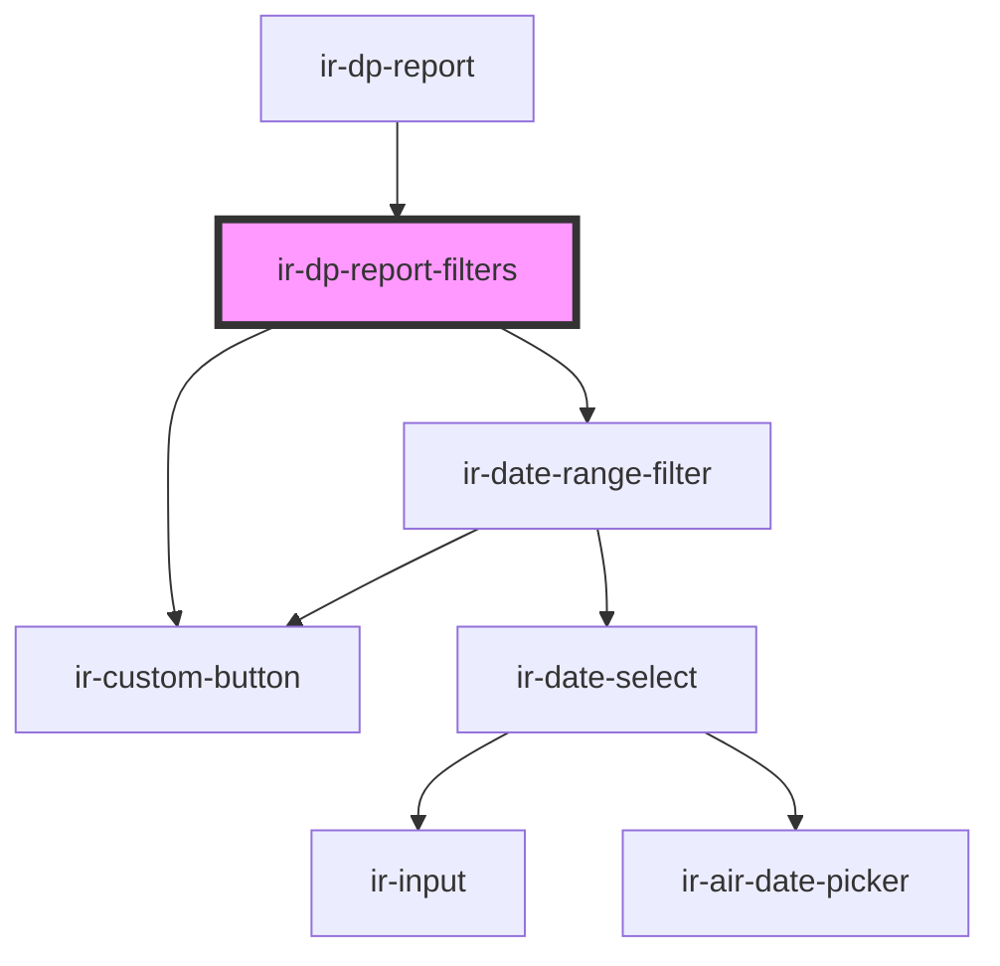

# ir-dp-report-filters

<!-- Auto Generated Below -->

## Properties

| Property  | Attribute  | Description                                                                                                                               | Type     | Default     |
| --------- | ---------- | ----------------------------------------------------------------------------------------------------------------------------------------- | -------- | ----------- |
| `minDate` | `min-date` | Earliest selectable date. Set by the parent once it discovers that the property's data does not go back the full default lookback window. | `string` | `undefined` |

## Events

| Event             | Description                                                                                                                                                                                                                  | Type                                         |
| ----------------- | ---------------------------------------------------------------------------------------------------------------------------------------------------------------------------------------------------------------------------- | -------------------------------------------- |
| `dpFiltersChange` | Emitted only when the user clicks Search. The shared store (updated as soon as the dates change) keeps every filter instance (chart tab + table tab) visually in sync regardless of whether a search has been triggered yet. | `CustomEvent<{ from: string; to: string; }>` |

## Dependencies

### Used by

 - [ir-dp-report](..)

### Depends on

- [ir-date-range-filter](../../ui/ir-date-range-filter)
- [ir-custom-button](../../ui/ir-custom-button)

### Graph

----------------------------------------------

*Built with [StencilJS](https://stenciljs.com/)*
