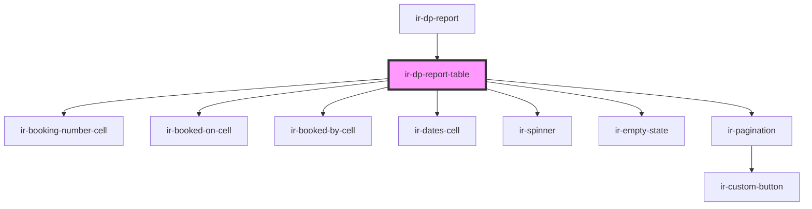

# ir-dp-report-table

<!-- Auto Generated Below -->

## Dependencies

### Used by

 - [ir-dp-report](..)

### Depends on

- [ir-booking-number-cell](../../table-cells/booking/ir-booking-number-cell)
- [ir-booked-on-cell](../../table-cells/booking/ir-booked-on-cell)
- [ir-booked-by-cell](../../table-cells/booking/ir-booked-by-cell)
- [ir-dates-cell](../../table-cells/booking/ir-dates-cell)
- [ir-spinner](../../ui/ir-spinner)
- [ir-empty-state](../../ir-empty-state)
- [ir-pagination](../../ir-pagination)

### Graph

----------------------------------------------

*Built with [StencilJS](https://stenciljs.com/)*
