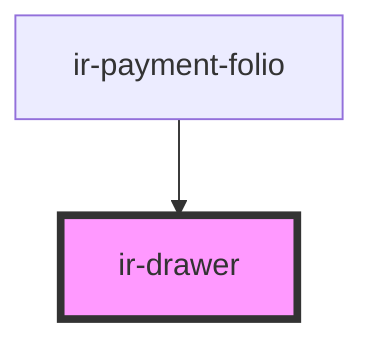

# ir-drawer

<!-- Auto Generated Below -->

## Properties

| Property        | Attribute        | Description                                                                                                                                                                                       | Type                                    | Default     |
| --------------- | ---------------- | ------------------------------------------------------------------------------------------------------------------------------------------------------------------------------------------------- | --------------------------------------- | ----------- |
| `label`         | `label`          | The drawer's label as displayed in the header. You should always include a relevant label, as it is required for proper accessibility. If you need to display HTML, use the `label` slot instead. | `string`                                | `undefined` |
| `lightDismiss`  | `light-dismiss`  | When enabled, the drawer will be closed when the user clicks outside of it.                                                                                                                       | `boolean`                               | `true`      |
| `open`          | `open`           | Indicates whether or not the drawer is open. Toggle this attribute to show and hide the drawer.                                                                                                   | `boolean`                               | `undefined` |
| `placement`     | `placement`      | The direction from which the drawer will open.                                                                                                                                                    | `"bottom" \| "end" \| "start" \| "top"` | `undefined` |
| `withoutHeader` | `without-header` | Disables the header. This will also remove the default close button.                                                                                                                              | `boolean`                               | `undefined` |

## Events

| Event        | Description                                                                                                                                                                                                                                                                                                                                                                                                                         | Type                                |
| ------------ | ----------------------------------------------------------------------------------------------------------------------------------------------------------------------------------------------------------------------------------------------------------------------------------------------------------------------------------------------------------------------------------------------------------------------------------- | ----------------------------------- |
| `drawerHide` | Emitted when the drawer is requesting to close. Calling event.preventDefault() will prevent the drawer from closing. You can inspect event.detail.source to see which element caused the drawer to close. If the source is the drawer element itself, the user has pressed Escape or the drawer has been closed programmatically. Avoid using this unless closing the drawer will result in destructive behavior such as data loss. | `CustomEvent<{ source: Element; }>` |
| `drawerShow` | Emitted when the drawer opens.                                                                                                                                                                                                                                                                                                                                                                                                      | `CustomEvent<void>`                 |

## Dependencies

### Used by

 - [ir-payment-folio](../ir-booking-details/ir-payment-details/ir-payment-folio)

### Graph

----------------------------------------------

*Built with [StencilJS](https://stenciljs.com/)*
